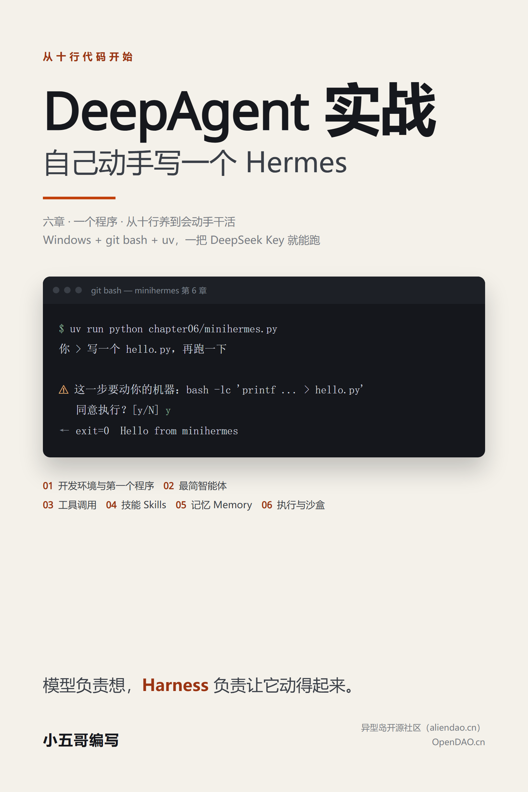

# DeepAgent实战：自己动手写一个Hermes

一本讲 DeepAgent 实战的中文电子书。全书六章只做一个程序：从十行代码起步，一章加一样功能，最后形成一个命令行智能体 **minihermes**，它是 Hermes 的教学替身。



## 下载

- [**《DeepAgent实战：自己动手写一个Hermes》PDF**](DeepAgent实战-自己动手写一个Hermes.pdf)：带封面、目录和页码，适合通读、打印
- [**同内容的 Word 版**](DeepAgent实战-自己动手写一个Hermes.docx)：想改排版、加批注或自己导出别的格式时用

## 目录

| 章 | 标题 | 这一章做什么 |
| --- | --- | --- |
| 1 | [开发环境搭建与第一个程序](chapter01/README.md) | 装 git bash 与 uv、配 DeepSeek Key、写出第一个十行版本 |
| 2 | [用 DeepAgent 开发最简智能体](chapter02/README.md) | 装上 `create_deep_agent`、给它身份、让文件落到 `workspace/` |
| 3 | [工具调用：给智能体接入联网能力](chapter03/README.md) | 自己写两个工具（Playwright 搜索 + trafilatura 抽取正文），让它查资料写报告 |
| 4 | [技能（Skills）：把做事的方法固化成能力](chapter04/README.md) | 一份 `SKILL.md` 把"这类活怎么干"固化下来，按需加载；顺带聊自进化 |
| 5 | [记忆（Memory）：让智能体跨会话记住用户](chapter05/README.md) | 跨进程记住用户，验证方式是"关掉再开一个新进程问它" |
| 6 | [程序执行与沙盒：让智能体安全地动手干活](chapter06/README.md) | QuickJS 内存执行 + git bash 执行，四道闸门，危险动作先确认 |

## 这本书的 Harness 主线

模型负责想，Harness（挽具）负责让它想得下去、动得起来。六章里的每一章都往这副挽具上添一样东西，每章结尾都留了一小段「Harness 视角」讲清添的是哪一层：

| 章 | 添进挽具的那一层 |
| --- | --- |
| 1 | 最小的挽具：循环与上下文 |
| 2 | 中间层：循环托管、工具层、文件去处 |
| 3 | 手：自己写的工具，和写给模型的说明书 |
| 4 | 手艺与上下文预算：技能的按需加载 |
| 5 | 状态：会话内与会话外 |
| 6 | 边界：执行、审批、人在环 |

想看完整的定义，从第 1 章 1.2 节读起；想看这条线最终长成什么样，直接翻第 6 章的小结。

## 每章的结构

六章按同一套骨架写，方便你按自己的节奏学：想先懂原理就顺着读，只想动手就跳到第二、三节。

| 小节 | 内容 | 怎么用 |
| --- | --- | --- |
| 本章概述 | 一段话：这一章讲什么、学完能得到什么 | 先看这段，知道这一章的靶子 |
| 一、基本原理 | 用到的技术、原理、依赖环境 | 概念不清楚就回来细读 |
| 二、程序介绍 | **该章完整程序一次给全**，再分段讲解 | 通读一遍，重点看"与上一章的差别" |
| 三、运行过程 | 环境准备、真实运行记录与截图、结果说明 | 照着敲一遍，比看十遍强 |
| 四、本章小结 | 这一章做成了什么、还差什么，末尾一段「Harness 视角」点明这章添了挽具的哪一层 | 忘了上章讲过什么就翻这里 |

程序在第二节就讲完，第三节只管跑。你不用担心"边讲边练"跟丢思路：每章都是先讲原理，再看完整程序，最后动手实践。

## 环境约定

所有命令都在 **git bash** 里执行；环境一律用 **uv** 管（不用 Anaconda）；沙盒不用 Docker；全部纯 Python，不引 Node.js 工具链。

git bash 怎么打开：**在项目文件夹的空白处点右键，选「Open Git Bash Here」**（中文系统里显示「Git Bash Here」），窗口就直接开在这个目录下。

实测版本：deepagents 0.7.15、langchain 1.4.2、langchain-openai 1.6.2、langgraph 1.2.11、CPython 3.12.11；模型统一用 `deepseek-v4-flash`（`OPENAI_BASE_URL=https://api.deepseek.com`）。

关于uv和git的安装，请参见工具本身的说明文档。

## 跑起来

把仓库 clone 下来，在项目目录里右键 →「Open Git Bash Here」开一个 git bash 窗口，然后：

```bash
uv sync                            # 还原环境（依赖在 pyproject.toml，版本锁在 uv.lock）
uv run playwright install chromium # 第 3 章要用浏览器，下一次就够（约 150MB）
cp .env.example .env               # 填上你自己的 DeepSeek Key
uv run python chapter01/minihermes.py
```

## 三个东西别搞混

| | 是什么 | 是否自带命令行？ |
| --- | --- | --- |
| `deepagents` | 库（Harness）。`create_deep_agent()` 返回一张编译好的 LangGraph 图，得自己驱动 | 无 |
| `deepagents-code`（`dcode`） | 官方基于它做的成品终端智能体 | 有，敲 `dcode` |
| 本书的 `minihermes` | 自己写的外壳 + 往里头装的 DeepAgent | 有，我们自己写 |

## 目录结构

```text
front.png             封面图（1600×2400，README 和各处宣传共用这一张）
chapterNN/            每章：README.md（正文）+ minihermes.py（该章完整代码）+ images/（运行截图）
DeepAgent实战-…pdf     整本书的 PDF（封面 + 目录 + 六章）
DeepAgent实战-…docx    整本书的 Word 版
.env / .env.example   模型 Key（.env 不进仓库）
pyproject.toml        依赖声明
uv.lock               版本锁
workspace/            智能体的工作目录，第 2 章起出现（不进仓库）
```

仓库里只有书本身：正文、每章代码、截图、依赖声明。写书过程中用的脚手架（复现某章对话的脚本、截图工具、探针、可行性记录）不放进这个仓库，集中收在旁边一个开发目录里，读者不需要它们。

## 写书时踩过的坑（省得你也踩）

- git bash 以登录 shell 启动会重读 profile 重置 `PATH`，手动 activate 常被冲掉，用 `uv run` 更省心。
- `pip install --upgrade pip` 会把 conda 环境的 pip 弄坏（`No module named 'pip._vendor.rich.markup'`），所以这本书只用 uv。
- DuckDuckGo 在国内连不上（超时），搜索改走 Playwright。
- `LocalShellBackend` 在 Windows 调用的是系统自带的那个 shell，不是 git bash，所以第 6 章自己写一个 git bash 执行工具。
- 不给 `create_deep_agent` 传 `system_prompt` 时，模型收到的系统提示词是空的，它会自己编一个身份（实测：旧模型自称 Claude Code，`deepseek-v4-flash` 则说自己是"一个 AI 助手，可以帮你查资料、读代码、写文件、跑搜索"——都是从工具清单里猜的）。
- 文件工具看到的 `/` 和 shell 看到的工作目录不是一回事。agent 把绝对路径（`~/deepagent-course/workspace/hello.py` 这种）拼进命令就找不到文件，得在工具说明和系统提示词里点明"用相对路径"。
