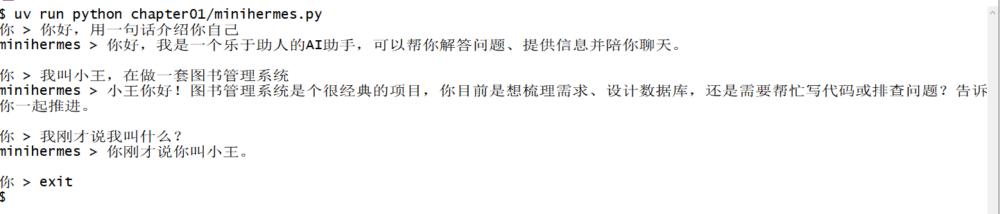

# 第 1 章 开发环境搭建与第一个程序

我让 Hermes 帮我查一件事。它会自己搜索，读取网页，在工作目录里写下笔记，最后交给我一份带出处的总结报告。中间还停下来问了一句：这条命令要执行吗？看它跑完，我冒出来的是另一个问题：如果从零开始写这么一个东西，第一行该敲什么。

本章就干这件事，分两部分：先把工作台搭起来（git bash 敲命令、uv 管环境、DeepSeek 作为模型支持），再写出第一个能用的命令行程序——十行代码，先只实现对话，它叫 minihermes。学完这一章应该能自己复现一套相同的环境，让程序在终端里连着跟你聊天，并且明白三件事：模型其实什么都不记得、"聊天记录"是怎么来的、为什么说智能体只是"一个循环加一份上下文"。后面五章要加的所有东西，都得从这个十行的内核里长出来。

## 一、基本原理

### 1.1 它其实什么都不记得

很多人第一次用大模型，都会以为它"记得"昨天说过的话。

事实是它一点都不记得。模型是无状态的，每次请求都是全新的开始。你可以把它当成一位学识渊博的老先生，答起问题来条理清楚，但他不知道你是谁，也不记得你们五分钟前聊过什么。你想让他接着刚才的话题往下说，就得把前情再讲一遍。

我们也确实是这么干的。所谓"聊天记录"，说白了就是每次请求把之前每一轮的问答重新发一遍。他显得记得，是因为我们在替他记。

从这里能推出三件事，后面几章都会用到：

- 聊得越久，要重发的内容越多，花的 token 越多。所以会有"上下文太长怎么办"这个问题。
- 进程一关，前情就没了，他又变回陌生人。所以会有"记忆"这回事。
- 所谓智能体，并不是更聪明的模型。它只是一个替老先生记事、递工具、跑腿的循环。

### 1.2 Harness：模型外面那层工程

英文里 harness 是马具、挽具的意思。一副好挽具能把马的气力套住，引到该去的地方。马再壮，挽具不行，车还是跑不起来。

AI 圈把这词借过来，指模型外面那层工程，我觉得挺贴切。模型负责想，想到什么程度是它的本事；外面这层工程负责把想法变成动作。文件怎么读写，工具调错了怎么重试，上下文塞满了怎么压缩，危险操作怎么拦住，都是它的活。

圈里常讲一句话：模型决定上限，Harness 决定下限。日常用下来觉得顺手还是别扭，多半是下限的事。

本书技术栈的主角 DeepAgent（Python 包名 `deepagents`）就是 LangChain 官方做的一个 Harness。它是个独立的包，底下站在 LangChain 和 LangGraph 上，把下面这些枯燥但又必须的事都办了：

| 替我们做好的事 | 具体是什么 |
| --- | --- |
| 文件系统工具 | `ls`、`read_file`、`write_file`、`edit_file`、`delete`、`glob`、`grep` |
| 任务规划 | 让它先写清单再逐条打勾（需要时挂上对应的中间件） |
| 子智能体 | 把子任务派给专门的子 agent（`task` 工具） |
| 上下文管理 | 聊天记录太长自动摘要，大结果卸载到文件 |
| 技能 Skills | 把"这类活怎么干"写成 `SKILL.md`，用到时才加载 |
| 记忆 Memory | 用文件做长期记忆，跨会话不忘 |
| 可换后端 | 文件放内存、放本地磁盘、放沙盒，一句话切换 |
| 人工确认 | `interrupt_on`：指定哪些操作前必须先问你 |

这副挽具不是一次装成的。往后五章，每一章都往它身上添一样东西。每章尾声我都会留一小段「Harness 视角」，说明这一章添的是哪一层：添之前模型缺什么，添之后挽具管住了什么。

### 1.3 它有骨架，但没有外壳

有件事得先说清楚，不然到第二章会可能会疑惑，那就是：deepagents 是个库，不是命令行程序。

经过验证：装完之后 `.venv/Scripts` 里没有任何可执行文件，包也没注册任何命令。`create_deep_agent(...)` 交给你的是一张编译好的 LangGraph 图，剩下的事情得你自己来。读输入、打印输出、`你 > ` 这个提示符、斜杠命令，全都不在包里。

换句话说，**命令行是我们自己搭的外壳**（本章那十行干的就是这件事），DeepAgent 是往这个外壳里装的骨架。两件事分得很清楚。

（官方另有一个做好的终端智能体叫 Deep Agents Code，命令是 `dcode`，装完敲 `dcode` 就能用，记忆、技能、沙盒、审批都齐了。它把一切都封好，也正因为封得太好，你看不到里面的循环。那是留给我们当对照用的，不是这本书的起点。）

那为什么不干脆用现成的？因为后面五章我们干的事，全都是改这个循环：换工具、塞技能、接记忆、加沙盒。如果连循环长什么样都不知道，改起来就是瞎猜，出了问题也不知道该往哪看。

### 1.4 全书路线

路线是：**先手写外壳，再往里面装骨架，然后一层层改造它。** 每一章都是同一个程序，代码在 `chapterNN/minihermes.py`，可以单独跑，不必先跑前面几章。

| 章 | 这一章给 minihermes 加什么本事 | 这一章添进挽具的那一层 |
| --- | --- | --- |
| 1 | 开发环境搭建与第一个程序：十行，只会说话 ← 本章 | 最小的挽具：循环与上下文 |
| 2 | 用 DeepAgent 开发最简智能体：会读写文件、会自己拆步骤 | 中间层：循环托管、工具层、文件去处 |
| 3 | 工具调用：给智能体接入联网能力 | 手：自己写的工具，和写给模型的说明书 |
| 4 | 技能（Skills）：把做事的方法固化成能力 | 手艺与上下文预算：按需加载 |
| 5 | 记忆（Memory）：让智能体跨会话记住用户 | 状态：会话内与会话外 |
| 6 | 程序执行与沙盒：让智能体安全地动手干活 | 边界：执行、审批、人在环 |

书里这个程序叫 minihermes。它和 Hermes 的关系，大概相当于模型车和真车：架构是通的，尺寸小很多，但每颗螺丝你都亲手拧过。

### 1.5 依赖环境：三样东西

开工前要准备三样：敲命令的终端、装东西的环境、能说话的模型。

**git bash。** 本书所有命令都在 git bash 里跑，它是你唯一的终端。

先装 Git for Windows（<https://git-scm.com/download/win>，一路默认）。装完不用去开始菜单里找快捷方式：**在项目文件夹的空白处点右键，选「Open Git Bash Here」**（中文系统里显示「Git Bash Here」），窗口就直接开在这个目录下。验一下：

```bash
git --version
```

后面凡是说"在终端里运行"、"敲一条命令"，指的都是这个窗口：在项目目录里右键打开它，照着敲。

**uv。** Python 环境的老问题你大概都遇过：装个包把别的项目搞坏了，换台电脑环境重装一下午。uv 是用 Rust 写的，一个命令同时管三件事：装 Python、建虚拟环境、装依赖。最大的好处是不碰系统环境，一个项目一个 `.venv` 文件夹，装坏了删掉重来，一分钟。

```bash
curl -LsSf https://astral.sh/uv/install.sh | sh
uv --version
```

这里交代一个我自己踩的坑。这本书最初我是在 conda 环境里起步的，手滑执行了 `pip install --upgrade pip`，pip 自带的 vendored 依赖当场坏掉，报 `No module named 'pip._vendor.rich.markup'`，修了半天。uv 不会出这种事，出了删掉 `.venv` 重来就行。这也是后面全程只用 uv 的原因。

**DeepSeek 的 Key。** 模型我们选 DeepSeek：中文好，便宜，接口兼容 OpenAI。去 <https://platform.deepseek.com> 注册登录，在 API Keys 里建一个 Key，形如 `sk-...`。它只显示一次，先复制存好。本章用的模型名是 `deepseek-v4-flash`。

## 二、程序介绍

### 2.1 完整程序

新建 `chapter01/minihermes.py`，整份内容如下，一共十行：

```python
# minihermes.py —— 第 1 章：10 行以内的命令行智能体   运行：uv run python chapter01/minihermes.py
from dotenv import load_dotenv; load_dotenv()
from langchain_openai import ChatOpenAI
model = ChatOpenAI(model="deepseek-v4-flash")           # 读 .env 里的 OPENAI_API_KEY / OPENAI_BASE_URL
history = []                                            # 会话上下文：一问一答都追加到这里
while (q := input("你 > ")).strip() not in ("", "exit", "quit"):
    history.append({"role": "user", "content": q})      # 记住用户说了什么
    reply = model.invoke(history).content               # 连历史一起发给模型
    history.append({"role": "assistant", "content": reply})
    print("minihermes >", reply, "\n")
```

### 2.2 逐行讲解

第二行把 `.env` 读进环境变量。第三、四行把模型请进来，Key 和地址都由 `.env` 提供，代码里不出现。

第五行的 `history = []` 是那位老先生的"前情记要"，此刻空的。

第六行开始主循环：打印 `你 > `，等你敲一行。空行、`exit`、`quit` 都算结束对话。`:=` 是海象运算符，边赋值边判断，能省一行。

第七行把你刚说的这句记进前情。第八行把模型叫来，注意递过去的是全部历史，不只是这一句。第九行把它答的话也记下来，下一轮要带上。第十行念给你听。

真正跟模型有关的只有第四行，剩下九行都在做同一件事：替他记着前情，每次重新讲一遍。

### 2.3 这段程序里没有的东西

十行里没有工具、没有记忆、没有文件读写，也没有任何"智能体"框架的调用。它就是"一个循环加一份上下文"——前面 1.1 节推出来的那个结论，在这里只剩两行 Python。

外壳和骨架的分界线也在这里：这一章我们只搭了外壳。从第 2 章起往壳里装 `create_deep_agent(...)`，壳本身不换。

## 三、运行过程

### 3.1 环境准备

挑一个放代码的目录（本书下面统一用 `~/deepagent-course` 表示，你自己换成实际路径），开一个 git bash：

```bash
cd ~/deepagent-course
uv venv --python 3.12 .venv      # 建虚拟环境；本机没有 3.12，uv 会自己下一个
```

接着在项目根目录写 `pyproject.toml`，把这本书要用的东西声明清楚：

```toml
[project]
name = "deepagent-course"
version = "0.1.0"
requires-python = ">=3.11"
dependencies = [
    "langchain-openai>=1.6.2",       # 和模型说话（DeepSeek 兼容 OpenAI 接口）
    "python-dotenv>=1.2.3",          # 读 .env 里的 Key
    "deepagents[quickjs]>=0.7.15",   # 第 2 章的主角；quickjs 是第 6 章的沙盒
    "playwright>=1.63.0",            # 第 3 章：驱动浏览器搜索
    "trafilatura>=2.2.0",            # 第 3 章：把网页正文抽出来
]

# 国内建议加上，走清华镜像
[[tool.uv.index]]
name = "tuna"
url = "https://pypi.tuna.tsinghua.edu.cn/simple"
default = true
```

清单里后两个包（`playwright`、`trafilatura`）是第 3 章才用到的，这里一并写上。原因很实在：全书的依赖一次装齐，读到后面就不用回头补。你当然也可以只写前三个，到第 3 章再 `uv add playwright trafilatura`，结果一样，只是多敲一次命令。

然后装依赖：

```bash
uv sync
```

装完会多出一个 `uv.lock`，它把每个包的版本都钉死了。把它一起提交进仓库，将来换电脑或者过半年回来，`uv sync` 一条命令就能还原出今天这个环境。以后加包一律用 `uv add 包名`，不要手改文件。

最后把 Key 放进项目根目录的 `.env`：

```ini
OPENAI_API_KEY=sk-你的Key
OPENAI_BASE_URL=https://api.deepseek.com
OPENAI_MODEL=deepseek-v4-flash
```

你可能会奇怪，明明是 DeepSeek，变量名怎么是 `OPENAI_`。因为 DeepSeek 的接口跟 OpenAI 完全兼容，`langchain-openai` 默认就读这几个名字。顺着它的规矩来，代码里就一个字都不用写 Key 和地址，这是后面能压到十行的关键。`.env` 不要提交到仓库，本书的 `.gitignore` 已经去掉了。

### 3.2 跑起来

```bash
uv run python chapter01/minihermes.py
```

`uv run` 会自动找到本项目 `.venv` 里的解释器，不用先 activate。这点在 git bash 里特别省事：我实测过，git bash 作为登录 shell 启动时会重读 profile 把 `PATH` 重置，手动 activate 时不时就被冲掉。

下面是我这边的真实对话记录：

```text
你 > 你好，用一句话介绍你自己
minihermes > 你好，我是由深度求索公司开发的AI助手，可以帮你解答问题、处理信息并陪你聊天。

你 > 我叫小王，在做一套图书管理系统
minihermes > 小王你好！图书管理系统是个很实用的项目，我可以帮你梳理需求、设计数据库、写代码、做界面或排查问题——你现在进行到哪一步了？

你 > 我刚才说我叫什么？
minihermes > 你刚才说你叫**小王**，正在做一套图书管理系统。

你 > exit
```



*上面这张是 git bash 窗口里的原样截图，不是手抄的。*

三轮对话里有三件事值得留意。

第三轮它答对了名字。它并没有记住你，是我们在第八行把前两轮一起递了过去。想通这个，才算真的理解智能体。

关掉窗口再打开，它会问你"你是谁"。它没变笨，是我们还没给它准备记事本，那是第 5 章的事。

回答里的 `**` 星号是 Markdown 记号，模型习惯这么写。这种小毛病等第 2 章换上正经的 Harness，终端能把格式渲染出来时就顺手修掉了。

## 四、本章小结

这一章办了三件事。讲清了 DeepAgent 是什么；把工作台支了起来，git bash 敲命令，uv 管环境，DeepSeek 出脑子，Key 放在 `.env`；写出了第一版 minihermes，十行，能连着聊。

它现在的状态是有嘴没手：不会打开文件，不会上网，不会写字，也不会替你跑一段代码。

下一章，命令行还是今天这个命令行，我们往里边装 DeepAgent。装完之后 minihermes 会长出文件工具和子智能体，也会第一次在磁盘上留下东西：一个叫 `workspace/` 的目录，里面躺着它自己写的笔记。

**Harness 视角**：这一章那十行就是一副最小的挽具，它只干两件事——把你说过的话按顺序攒起来，攒够了递给模型。整段程序里真正碰到模型的只有 `agent.invoke(messages)` 那一行，另外九行都在替它记着前情。往后每一章，都是往这十行上添零件：添手、添记事本、添规矩。模型的力气没变，挽具越来越像样。
