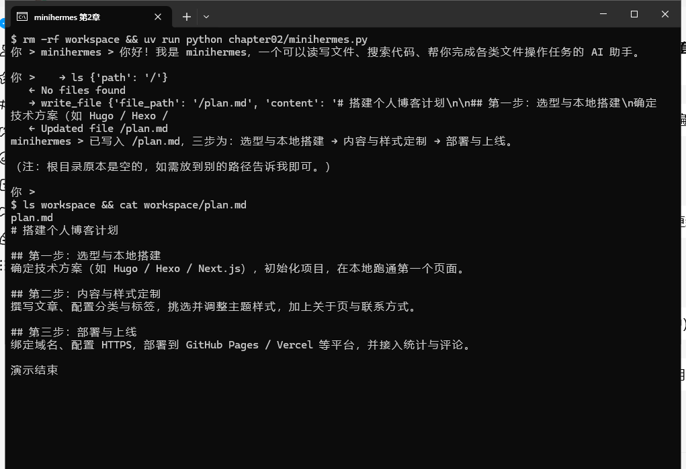

# 第 2 章 用 DeepAgent 开发最简智能体

第 1 章那个十行的小程序只会对话。这一章我们把 DeepAgent 装进同一个CLI里，装完之后仍然什么都不加：不给它自写的工具，不接记忆，不联网。计划很简单，就想看看它自己进来之后什么样。

学完这一章，你手上会有一个会自己列目录、读文件、写文件、遇到多步任务会自己拆着做的迷你智能体；也会知道它进来时带的两个默认设置（没有身份、文件只存在内存里）为什么必须改，怎么各用一行代码改掉。这两件事看着小，后面每一章都建立在它们之上。

## 一、基本原理

### 1.1 装进去的是一张图，不是模型

`create_deep_agent(...)` 返回的不是模型，而是一张编译好的 LangGraph 图，里面有循环、有工具节点、有上下文管理。我们要的东西都在里面。第 1 章那句"智能体只是一个循环加一份上下文"，到这一章终于有实物了：循环在包里，上下文管理也在包里，我们写的只是驱动它的那几行。

### 1.2 外壳不变，变的是中间层

第 1 章我们自己维护 `history`，一轮一轮往里追加。这一章不再手工攒了，交给 agent 自己的检查点（`checkpointer`）来管。`config` 里的 `thread_id` 是会话编号：同一个编号就是同一段对话，换一个编号就是另开一局。这也解释了为什么每轮只递一句新输入就够了，前面的它自己记得。

命令行这一层原样保留：还是 `你 > ` 提示符，还是那个 `while` 循环。从第 1 章到第 6 章，这一层都不换。

### 1.3 包里带的七个文件工具

我们一个工具都没写，但它现在有七个，全是包里带的：`ls`、`read_file`、`write_file`、`edit_file`、`delete`、`glob`、`grep`。

其中 `write_file` 和 `edit_file` 的区别值得记一下：前者整份覆盖，后者按片段改。agent 改一份长文件时用 `edit_file` 比重新写一遍更省 token，也更不容易出错。

有一个常见误会要澄清：任务规划（那个先写 TODO 再逐条打勾的本事）不是默认开的，得另外挂一个 `TodoListMiddleware` 才生效。子智能体不一样，它是**默认就有的**：包里会自动加一个叫 `general-purpose` 的子智能体，所以 `task` 工具开箱就能用（我是在第 4 章那趟运行里看到它自己派了个子任务才回头查证的，源码里 `graph.py` 那句 `inline_subagents.insert(0, general_purpose_spec)` 就是它）。想换成自己的子智能体，传 `subagents=[...]` 即可。

### 1.4 它进来时的两个默认

**没有身份。** 不给 `system_prompt` 时，模型收到的系统提示词是空的。包里确实躺着一份默认提示词（`You are a deep agent, an AI assistant that helps users accomplish tasks using tools...`），但在我们这个情况下没被用上。于是模型手里只有一张工具清单，它会顺着这张清单给自己编一个身份。

**文件只在内存里。** 默认后端（`StateBackend`）把文件存在 agent 的内存里，会话一结束就没了。想让它落在磁盘上，得换成 `FilesystemBackend`。

这两条都不是 bug，是它把选择权留给了我们。所以本章要拧两颗螺丝：给它身份，给它文件的去处。

## 二、程序介绍

### 2.1 完整程序

新建 `chapter02/minihermes.py`，整份内容如下：

```python
# minihermes.py —— 第 2 章：把 DeepAgent 装进第 1 章那个命令行CLI外壳
from pathlib import Path

from dotenv import load_dotenv; load_dotenv()
from langchain_core.messages import HumanMessage
from langchain_openai import ChatOpenAI
from langgraph.checkpoint.memory import InMemorySaver
from deepagents import create_deep_agent
from deepagents.backends import FilesystemBackend

WORKSPACE = Path(__file__).resolve().parent.parent / "workspace"
WORKSPACE.mkdir(exist_ok=True)

model = ChatOpenAI(model="deepseek-v4-flash")
agent = create_deep_agent(
    model=model,
    system_prompt="你是 minihermes，用中文回答，回答简洁。",
    backend=FilesystemBackend(root_dir=str(WORKSPACE)),
    checkpointer=InMemorySaver(),
)
config = {"configurable": {"thread_id": "minihermes"}}

while (q := input("你 > ")).strip() not in ("", "exit", "quit"):
    for step in agent.stream({"messages": [HumanMessage(content=q)]}, config=config, stream_mode="updates"):
        for update in step.values():
            for m in (update or {}).get("messages") or []:
                for tc in getattr(m, "tool_calls", None) or []:
                    print("   →", tc["name"], str(tc["args"])[:90])
                if type(m).__name__ == "ToolMessage":
                    print("   ←", str(m.content).replace("\n", " ")[:90])
                elif getattr(m, "content", ""):
                    print("minihermes >", m.content, "\n")
```

### 2.2 与第 1 章的差别

大的变化只有两处。

第一，`agent = create_deep_agent(...)` 取代了裸模型。第二，我们不再自己维护 `history`，改由 checkpointer 管（见 1.2）。

剩下的都是外壳里的老东西：`load_dotenv()`、`ChatOpenAI`、`while` 循环、`你 > ` 提示符，一行没动。

### 2.3 那几行 print 是干什么的

程序里那段 `print` 是我们自己加的：把每一次工具调用打印出来。不加这段，你只能看到它最后说的话，看不到它中间干了什么。

它靠的是 `stream_mode="updates"`：agent 每走完一步就吐一块更新出来，我们逐块翻一遍，遇到 `tool_calls` 就打印箭头和参数，遇到 `ToolMessage` 就打印工具返回，剩下的是它说的话。这三行循环是本书的"透视眼"，后面几章调试全靠它。

### 2.4 两颗螺丝

**第一颗：身份。**

```python
system_prompt="你是 minihermes，用中文回答，回答简洁。",
```

你写进去什么，模型就收到什么（这里可以放心：我验过，25 个字符进去，25 个字符出来，没有在背后追加别的东西）。它决定了这个 agent 怎么说话、拿自己当什么。等到第 4 章讲技能时你会看到，有些本事更适合写在技能文件里按需加载，而不是一股脑塞进这里，那是后话。

**第二颗：文件的去处。**

```python
from deepagents.backends import FilesystemBackend
backend = FilesystemBackend(root_dir=str(WORKSPACE))
```

`root_dir` 指向项目根目录下的 `workspace/`。它同时是一道边界：agent 眼里的 `/` 就是这个目录，出不了这个院子。

## 三、运行过程

### 3.1 环境准备

本章不需要装新依赖，第 1 章那套环境直接用：

```bash
cd ~/deepagent-course
uv sync                                     # 若是新克隆的仓库，先还原环境
ls .env                                     # 确认 .env 还在（里面是 Key 和模型名）
uv run python chapter02/minihermes.py       # 能起来就说明环境没问题
```

`workspace/` 目录不用手动建，程序里那两行 `WORKSPACE.mkdir(exist_ok=True)` 会处理。

### 3.2 第一次跑：把两颗螺丝都松开

先不加 `system_prompt`，也不指定 `backend`，就是最光秃秃的一个 agent：

```python
agent = create_deep_agent(model=model, checkpointer=InMemorySaver())
```

问它一句：

```text
你 > 你好，用一句话介绍你自己
minihermes > 你好！我是一个 AI 助手，可以帮你查资料、读代码、写文件、跑搜索，处理各种综合性的任务。
```

它说自己是"一个 AI 助手"，能干的事情一口气报了一串：查资料、读代码、写文件、跑搜索。这不是我们告诉它的，是它从工具清单里猜出来的。为确认这件事，我把模型实际收到的系统提示词打出来看了一眼：

```text
=== 系统提示词：0 字符 ===
```

**空的。** 一个字的身份说明都没有。模型手里只有一张工具清单，身份全靠它自己编。

这里还有个更值得记的细节：同一个程序、同一份空提示词，**它每次给自己编的名号都不一样**。我这边见过"我是一个 AI 助手"，也见过它张口就说"我是 Claude，由 Anthropic 开发的 AI 助手"。注意，喂进去的明明是 DeepSeek。一个模型对自己是谁这件事，就是这么不可靠。

再让它干点活：

```text
你 > 把"搭建一个个人博客"拆成三步，写进 plan.md
   → ls {'path': '/'}
   ← No files found
   → write_file {'file_path': '/plan.md', 'content': '# 搭建个人博客计划\n\n## 第一步：选型与本地搭建\n确定技...
   ← Updated file /plan.md
minihermes > 已写入 `/plan.md`，三步为：选型与本地搭建 → 内容与样式定制 → 部署与上线。

（注：根目录原本是空的，如需放到别的路径告诉我即可。）
```

它自己调了 `write_file`，写了一份像模像样的计划，还顺带告诉你一句"根目录原本是空的"。（另一次跑的时候它更谨慎，挨个试了 `/tmp`、`/home`、`/workspace` 这些像工作目录的路径，全被挡回来才动手。**这种摸索不用你教，是它自己会的。**）

但如果你去项目目录里翻，会发现**磁盘上什么都没有**。文件存在 agent 的内存里，会话一结束就没了。

### 3.3 加上第一颗螺丝：身份

给它一句 `system_prompt`，它立刻换了自我介绍：

```text
你 > 你好，用一句话介绍你自己
minihermes > 你好！我是 minihermes，一个可以读写文件、搜索代码、帮你完成各类文件操作任务的 AI 助手。
```

同一句提问，回答完全不同。这就是系统提示词的分量。

### 3.4 加上第二颗螺丝：文件落盘

把 `backend=FilesystemBackend(root_dir=str(WORKSPACE))` 也加上，同一个任务再跑一遍。这次 `workspace/plan.md` 真的出现在磁盘上了：

```text
$ ls workspace && cat workspace/plan.md
plan.md
# 搭建个人博客计划

## 第一步：选型与本地搭建
确定技术方案（如 Hugo / Hexo / Next.js），初始化项目，在本地跑通第一个页面。

## 第二步：内容与样式定制
撰写文章、配置分类与标签，挑选并调整主题样式，加上关于页与联系方式。

## 第三步：部署与上线
绑定域名、配置 HTTPS，部署到 GitHub Pages / Vercel 等平台，并接入统计与评论。
```



*这张是 git bash 窗口里的原样截图。开头那句自我介绍就是 3.3 节的效果；中间的 `→ ls`／`→ read_file` 是它调用工具的痕迹（这趟它发现 `plan.md` 已经在了，直接读出来核对），`← @@ lines 1-10 of 10 @@` 是工具回话；最后两行是敲 `ls workspace && wc -c workspace/plan.md`，证明文件真的落在磁盘上（458 字节）。*

第 1 章结尾我说过它会第一次在磁盘上留下东西，现在兑现了。

### 3.5 一次多步任务的实录

不写工具照样能干活。给它一个三步任务：

```text
你 > 分三步做：先看工作目录里有什么文件，再写一份 notes.md 记录你的观察，最后用一句话总结。
   → ls {'path': '/'}
   → ls {'path': '/workspace'}
minihermes > 我先看看目录。

   ← Error: Path '/workspace': path_not_found
   ← ['/plan.md']
   → read_file {'file_path': '/plan.md'}
   ← @@ lines 1-12 of 12 @@ # 搭建一个个人博客  ## 三步计划  ### 第一步：选型与准备 确定定位与内容方向...
   → write_file {'file_path': '/notes.md', 'content': '# 观察记录\n\n## 工作目录内容\n- 目录只有 1 个文件：`plan.md`（共 12 行）
   ← Updated file /notes.md
minihermes > 工作目录只有 `/plan.md`，内容是一个"搭建个人博客"的三步计划（选型准备 → 搭建部署 → 写作维护），我已把观察写入 `/notes.md`。
```

看那几行 `→` 和 `←`：它先列目录（还顺手试了一下 `/workspace`，撞了个 `path_not_found`），读到 `plan.md` 又打开看了一遍，然后才动笔。那句"我先看看目录"是它自己加的说明，嫌它啰嗦的话，第 4 章会给系统提示词补一句把它管住。

## 四、本章小结

这一章我们做成的事：把 DeepAgent 装进了第 1 章的外壳，一行 `create_deep_agent(...)` 就够；拧了身份和文件去处两颗螺丝；看着它自己用 `ls`、`read_file`、`write_file` 完成了多步任务。

还有一件事定下来：它现在有七个文件工具，但和我们自己的程序一样，出不了 `workspace/` 这个院子。

下一章给它装上网的能力。搜索按你机器上能跑通的方案来（我这边实测过 DuckDuckGo 连不上，得换一条路），抓到网页正文之后，让它自己去查资料、写报告。

**Harness 视角**：这一章添的是一整层中间件。第 1 章里"替它记着前情"这件事，现在交给 `checkpointer`，`thread_id` 就是它记账的户头；模型每轮能看到的系统提示词、能调用的七个文件工具、以及能走到哪儿的边界（`workspace/` 这个院子），也全由这一层说了算。第 2 章的 32 行和第 1 章的 10 行比，只多了两处：一行把图装进来，一行把记事本挂上。外壳没动，换掉的是壳里的骨架。
