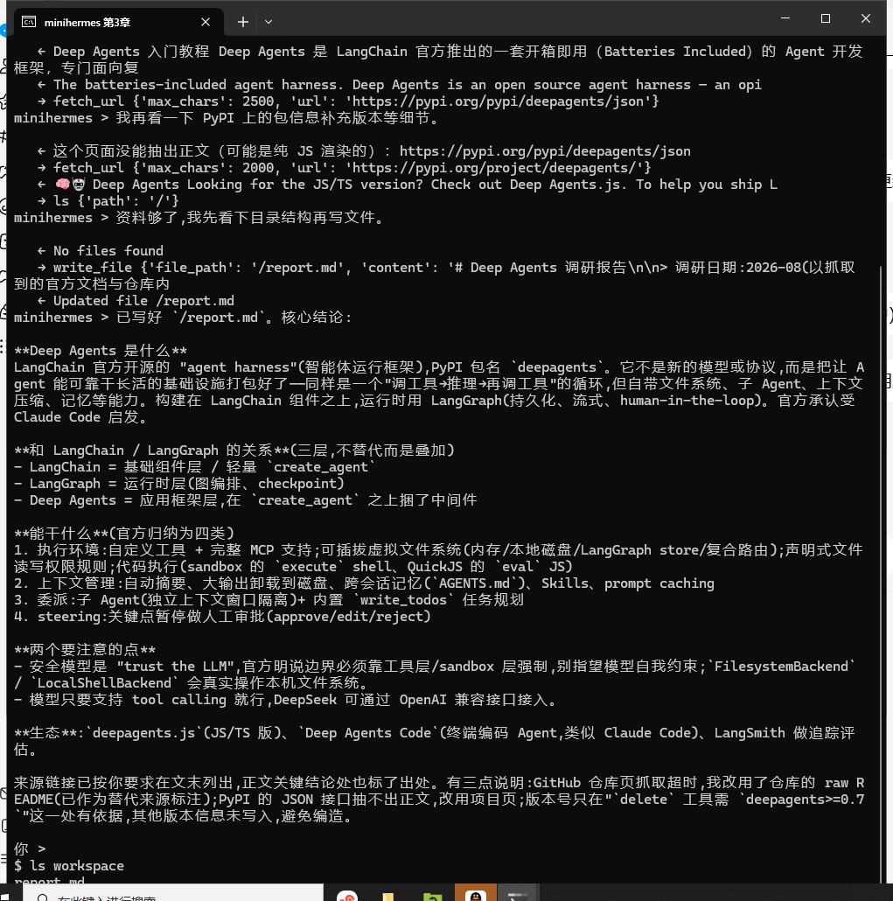

# 第 3 章 工具调用：给智能体接入联网能力

## 本章概述

到第 2 章为止，minihermes 是个住在自己院子里的聪明人：它会读写文件，会自己琢磨步骤，但院墙外面的事它一概不知道。你问它一件近来的事，它只有两个选择，说不知道，或者凭记忆编一个。这一章给它装两只手，让它能出去找。

本章手写两个工具：`web_search`（用浏览器搜网页）和 `fetch_url`（读网页正文），都是纯 Python，不要任何搜索服务的 Key，也不碰 Node 工具链。学完你应该能自己给智能体添工具，并且明白四件事：工具就是一个普通函数、docstring 是写给模型的说明书、工具返回的东西要算进上下文预算、工具失败时要返回能读懂的话而不是抛异常。最后我们会看着它独立查完一轮资料，写出一份带来源的报告。

## 一、基本原理

### 1.1 工具就是一个普通函数

先把这个概念说清楚，因为它比看上去简单。

一个工具，就是一个普通的 Python 函数。函数名是工具名，参数是入参，而**那个 docstring 就是写给模型看的说明书**。模型看到的不是代码，是这三样东西：

```python
def fetch_url(url: str, max_chars: int = 4000) -> str:
    """读一个网页的正文，返回去掉导航和广告之后的纯文本。

    什么时候用：已经有具体链接、需要看页面里到底写了什么时。
    长文会被截断，先读前面的部分通常就够判断要不要继续。
    """
```

调用的过程也很朴素，第 2 章你已经见过那两行痕迹了：

```text
   → web_search {'query': 'deepagents 是什么 能干什么'}
   ← 1. Deep Agents overview - Docs by LangChain    https://docs.langchain.com/...
```

`→` 是模型发号施令，`←` 是函数真的跑完、把返回值塞回上下文。一次工具调用就这么完成，没有魔法。

### 1.2 docstring 是产品文案

写工具的时候有个和平时不一样的习惯：**docstring 不是注释，是产品文案**。它得回答模型接下来会问自己的三个问题——这是干什么的、什么时候该用、什么时候别用。写得含糊，模型就会在错误的时机调用它，或者该调的时候不调。

上面那两段工具说明就是按这个思路写的：`fetch_url` 的说明里专门交代了一句"拿到链接之后再用它"，把两个工具的先后顺序讲明白；`web_search` 的说明里则点明"想知道有哪些网页在讲这件事时先用它"。这类句子在普通代码里显得啰嗦，在这里是接口文档。

### 1.3 搜索为什么自己造

官方文档给的方案是 Tavily（要申请 Key），或者用 Google、OpenAI 自带的搜索工具（要对应厂商的 Key）。两个我都不想要：这本书的前提是**一把 DeepSeek Key 走到底**。

那就先试最省事的。Python 里有个 `ddgs` 包，抓 DuckDuckGo 的结果，免费不要 Key：

```text
ddgs.exceptions.TimeoutException: error sending request for url (https://html.duckduckgo.com/html/)
```

超时。在国内连不上。

好在第 1 章装依赖时我们已经把 `playwright` 装上了（浏览器也下好了）。既然手上有浏览器，就让它去开必应搜——一样免费，一样不要 Key，还顺便演示了"工具是自己写的"这件事。搜回来的结果再交给 `trafilatura` 抽正文，这两个包都是纯 Python 的。

### 1.4 返回的东西要进上下文

这里有个地方值得停一下：**工具返回的东西是要进上下文的**，返回多少就占多少。一次搜索回来十条结果、每条带一整段摘要，几千字就没了；正文整篇塞回去更夸张。所以两个工具都在出口处做了整理——搜索只给 180 字摘要，正文默认截到 4000 字并注明被截断了。

工具写得"话少"，模型后面才有余量干活。

### 1.5 失败要能读懂

最后，两个工具都得能体面地失败。抓不到页面时我让它返回一句人话，而不是抛异常：

```python
if not html:
    return f"抓取失败（页面打不开或超时）：{url}"
```

这一点在三、运行过程里会看到效果：模型收到这句人话，就知道该换一条路；工具要是直接抛异常，任务当时就断了。

### 1.6 依赖环境

本章新增两个依赖，第 1 章的 `pyproject.toml` 里已经声明过：

| 依赖 | 干什么用 | 备注 |
| --- | --- | --- |
| `playwright` | 驱动 Chromium 搜网页 | 装完还要下浏览器：`uv run playwright install chromium` |
| `trafilatura` | 从 HTML 里抽正文 | 纯 Python，本地解析 |

本机实测的两个前提：DuckDuckGo 在国内连不上（超时），必应可用；Chromium 下到 `%LOCALAPPDATA%\ms-playwright\` 下，之后不再联网。

## 二、程序介绍

### 2.1 工具一：web_search

新建 `chapter03/web_tools.py`，第一个函数用浏览器打开必应的结果页，从 DOM 里把标题、链接、摘要抠出来：

```python
def web_search(query: str, max_results: int = 5) -> str:
    """用浏览器搜索网页，返回若干条结果的标题、链接和摘要。

    什么时候用：想知道"有哪些网页在讲这件事"、找官方文档、找最新消息时，先用它。
    拿到链接之后，再用 fetch_url 去读其中某一页的正文。
    """
    from playwright.sync_api import sync_playwright

    url = f"https://cn.bing.com/search?q={quote(query)}&setlang=zh-CN"
    with sync_playwright() as p:
        browser = p.chromium.launch(headless=True)
        page = browser.new_page(locale="zh-CN", user_agent=UA)
        page.goto(url, wait_until="domcontentloaded", timeout=30000)
        page.wait_for_selector("li.b_algo", timeout=15000)
        rows = page.eval_on_selector_all("li.b_algo", """els => els.map(e => {...})""")
        browser.close()

    lines = []
    for i, row in enumerate(rows[:max_results], 1):
        if not row.get("url"):
            continue
        lines.append(f"{i}. {row['title']}\n   {row['url']}\n   {row['snippet'][:180]}")
    return "\n".join(lines) if lines else f"没有搜到「{query}」的结果"
```

两个地方是写浏览器工具最容易栽的坑：`headless=True` 是不要弹出窗口，在后台悄悄搜；`wait_for_selector("li.b_algo")` 是等结果列表真的出现——网页搜索是异步加载的，不等它，抓回来就是一片空白。

抠数据用的是 `eval_on_selector_all`，里面那段 JavaScript 对每条结果取标题、链接和摘要。选 `li.b_algo` 是因为必应把自然结果都放在这个 class 下，比按整页文本猜稳当。文件顶部那串 `UA` 是伪装成普通浏览器，有些站点对无头浏览器不客气。

### 2.2 工具二：fetch_url

第二个函数短得多，几行就是全部：

```python
def fetch_url(url: str, max_chars: int = 4000) -> str:
    """读一个网页的正文，返回去掉导航和广告之后的纯文本。

    什么时候用：已经有具体链接、需要看页面里到底写了什么时。
    长文会被截断，先读前面的部分通常就够判断要不要继续。
    """
    import trafilatura

    html = trafilatura.fetch_url(url)
    if not html:
        return f"抓取失败（页面打不开或超时）：{url}"
    text = trafilatura.extract(html, include_comments=False, include_tables=True) or ""
    text = text.strip()
    if not text:
        return f"这个页面没能抽出正文（可能是纯 JS 渲染的）：{url}"
    if len(text) > max_chars:
        return text[:max_chars] + f"\n\n（正文共 {len(text)} 字，已截断）"
    return text
```

三种情况分别对应一句话：抓不到（网络问题）、抽不出（页面是纯 JS 渲染的）、抽出来太长（截断并注明）。每句都能读，模型据此决定下一步。

### 2.3 主程序

`chapter03/minihermes.py` 的完整内容：

```python
# minihermes.py —— 第 3 章：给 minihermes 装上网络（两个工具，不用 Node）
# 运行：uv run python chapter03/minihermes.py
from pathlib import Path

from dotenv import load_dotenv; load_dotenv()
from langchain_core.messages import HumanMessage
from langchain_openai import ChatOpenAI
from langgraph.checkpoint.memory import InMemorySaver
from deepagents import create_deep_agent
from deepagents.backends import FilesystemBackend

from web_tools import fetch_url, web_search   # 同目录，直接 import（脚本运行时会自动带上本目录）

WORKSPACE = Path(__file__).resolve().parent.parent / "workspace"
WORKSPACE.mkdir(exist_ok=True)

SYSTEM = (
    "你是 minihermes，用中文回答。"
    "需要查资料时先用 web_search 搜，再挑相关的链接用 fetch_url 读正文，"
    "写进文件的结论要标出来源链接。"
)

model = ChatOpenAI(model="deepseek-v4-flash")
agent = create_deep_agent(
    model=model,
    system_prompt=SYSTEM,
    tools=[web_search, fetch_url],
    backend=FilesystemBackend(root_dir=str(WORKSPACE)),
    checkpointer=InMemorySaver(),
)
config = {"configurable": {"thread_id": "minihermes"}}

while (q := input("你 > ")).strip() not in ("", "exit", "quit"):
    for step in agent.stream({"messages": [HumanMessage(content=q)]}, config=config, stream_mode="updates"):
        for update in step.values():
            for m in (update or {}).get("messages") or []:
                for tc in getattr(m, "tool_calls", None) or []:
                    print("   →", tc["name"], str(tc["args"])[:90])
                if type(m).__name__ == "ToolMessage":
                    print("   ←", str(m.content).replace("\n", " ")[:90])
                elif getattr(m, "content", ""):
                    print("minihermes >", m.content, "\n")
```

### 2.4 与第 2 章的差别

实质变化只有一行，把两个工具交上去：

```python
    tools=[web_search, fetch_url],      # ← 新的
```

系统提示词里加了一句交底：

```python
SYSTEM = (
    "你是 minihermes，用中文回答。"
    "需要查资料时先用 web_search 搜，再挑相关的链接用 fetch_url 读正文，"
    "写进文件的结论要标出来源链接。"
)
```

最后半句是给自己留的退路。模型默认不太爱标来源，而在这种"查了五个网页写一份报告"的活里，没有来源的报告等于没法核对。

## 三、运行过程

### 3.1 环境准备

```bash
cd ~/deepagent-course
uv sync                                    # 还原环境（会装上 playwright 和 trafilatura）
uv run playwright install chromium          # 下浏览器，只在第一次需要（约 150MB）
uv run python chapter03/minihermes.py       # 能起来就说明依赖齐了
```

第二条命令如果跳过，第一次搜索会报找不到浏览器可执行文件。装好的浏览器在 `%LOCALAPPDATA%\ms-playwright\` 下，之后离线也能跑。

### 3.2 一次真实调研

给它一个真活儿：

```text
你 > 查一下 deepagents 是什么、能干什么，写成 report.md，来源链接放最后。
```

下面是这一趟的原样记录——模型每次说话用词都会有出入，你照着跑不会和我这里一字不差，动作顺序是一致的：

```text
你 > 查一下 deepagents 是什么、能干什么，写成 report.md，来源链接放最后。
   → web_search {'query': 'deepagents', 'max_results': 6}
   → web_search {'query': 'langchain deepagents 是什么', 'max_results': 6}
minihermes > 我先搜一下 deepagents 的相关资料。
   ← 1. LangChain 中文教程 | LangChain 中文文档    https://langchain-doc.cn/
   ← 1. Deep Agents overview - Docs by LangChain    https://docs.langchain.com/oss/python/deepa...
   → fetch_url {'url': 'https://docs.langchain.com/oss/python/deepagents/overview', 'max_chars': 8000}
   → fetch_url {'url': 'https://github.com/langchain-ai/deepagents', 'max_chars': 8000}
minihermes > 官方文档和 GitHub 仓库看起来是最权威的，我读一下正文。
   ← - Take actions in an environment: Take actions via tools, read and write files, execute co...
   ← 抓取失败（页面打不开或超时）：https://github.com/langchain-ai/deepagents
   → fetch_url {'url': 'https://raw.githubusercontent.com/langchain-ai/deepagents/main/README.md', ...
   → fetch_url {'url': 'https://docs.langchain.org.cn/oss/python/deepagents/overview', ...
minihermes > GitHub 打不开，我换 raw README，并补读文档后半部分（子代理、人在环等）。
   ← 这个页面没能抽出正文（可能是纯 JS 渲染的）：https://docs.langchain.org.cn/oss/python/...
   ← 抓取失败（页面打不开或超时）：https://raw.githubusercontent.com/...
   → fetch_url {'url': 'https://docs.langchain.com/oss/python/deepagents/overview', 'max_chars': 24000}
   → fetch_url {'url': 'https://www.runoob.com/ai-agent/deep-agents-usage.html', 'max_chars': 6000}
   → fetch_url {'url': 'https://pypi.org/project/deepagents/', 'max_chars': 3000}
minihermes > 再确认一下 PyPI 上的包信息（版本、安装方式）。
   → write_file {'file_path': '/report.md', 'content': '# Deep Agents（deepagents）调研报告\n\n## 一、它是什么...
   ← Updated file /report.md
```

它最后交出来的是 `workspace/report.md`，一份有分节、有来源链接的调研报告。



*wt 里的原样截图。这一趟的窗口放不下全部输出，图上能看到的是后半程：几轮 `fetch_url` 之后写文件、以及它最后的总结。*

### 3.3 实录里的三件事

**它一次并发发了两个搜索。** 模型在一轮里可以吐出多个工具调用，框架会一起跑。搜索这种互不依赖的活，并发起来省时间。

**它失败了四次，自己换了三条路。** GitHub 页面抓不到（纯 JS 渲染），它换 raw README；raw 也失败，它转去读中文文档站；又失败，最后靠官方文档 + 菜鸟教程 + PyPI 页面凑齐。每一次失败工具返回的都是"抓取失败（页面打不开或超时）"这种能读懂的话，所以模型知道该换路。这就是 1.5 节那条规矩的回报。

**它自己给报告加了"提醒"。** 收尾那段话里写着"GitHub 和 raw README 当时抓取失败，仓库信息取自搜索结果摘要；官方示例中的模型名是抓取原文，实际用你自己的模型替换"。我没有让它写这些，是它自己判断该交代。

### 3.4 现阶段的不足

一是它话多。每做几个动作就要来一句"我先搜一下""再确认一下"，这些解说既占屏幕也占上下文。这一章先不管它，第 4 章给系统提示词加一句"干活过程中不要输出这类说明"，输出立刻就干净了。

二是抓取失败率高不高，取决于对方网站的脾气。纯 JS 渲染的站点 `trafilatura` 抽不出东西，这是它天生的短板——实测里 GitHub、知乎、中文镜像站三个都栽在这上面。真需要读这类页面，可以在 `fetch_url` 里换成"用 Playwright 打开、等渲染完再取文本"，代价是慢好几倍。这一章先不折腾。

## 四、本章小结

这一章 minihermes 有了两只手：`web_search` 搜，`fetch_url` 读。两个工具都是自己写的，纯 Python，没有引入任何 Key 和 Node 工具链。

顺带立下了写工具的几条规矩，后面几章都照这个来：docstring 当产品文案写、返回结果要控量、失败要返回人话。

现在的它：会在 `workspace/` 里读写文件，会自己上网查资料，写出来的东西会标来源。

下一章处理一个更容易被忽视的问题：**"查资料"这件事，它每次都要自己重新摸索一遍流程**。搜几个词、看哪些链接、报告写成什么结构——这些都是可以固化成"技能"的。我们会给它一份 `SKILL.md`，让它在需要的时候自己翻出来照着做，顺便聊聊技能怎么"自己长出来"。
