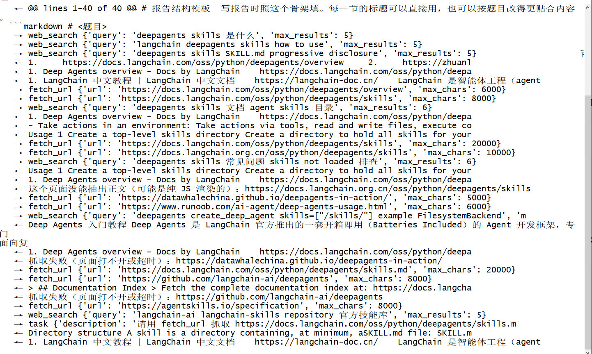

# 第 4 章 技能（Skills）：把做事的方法固化成能力

第 3 章的 minihermes 查资料已经很能干了，但有个问题：**它每次都在重新摸索**。搜几个词、挑哪几个链接、报告写成什么结构，全看它当时的心情，同一个任务跑两遍，两遍的结构都不一样。这不是它笨，是我们没把"这类活该怎么干"教给它。

这一章就来教。我们写一份 `SKILL.md`（一份写给模型看的操作手册），把它挂到智能体的技能目录上，让它在遇到这类任务时自己去翻、照着做。学完你应该能自己写技能，并且明白四件事：技能和工具的分工、`description` 为什么是唯一的广告位、三层渐进加载怎么省上下文、以及"让技能自己长出来"这件事为什么必须先解决控制权。

## 一、基本原理

### 1.1 工具是手，技能是手艺

第 3 章装的是工具：`web_search` 会搜，`fetch_url` 会读。工具管的是"能做什么"。

但"查一份资料并写成报告"这件事，光有手不够，还得知道套路：先定几组关键词、来源按什么优先级挑、结论要几处来源互证、报告要有哪几节、拿不准的怎么写。这些是手艺。

在 DeepAgent 里，手艺叫**技能（Skill）**。它和工具的分工很清楚：

| | 是什么 | 什么时候进上下文 |
| --- | --- | --- |
| 工具 | 一个能调用的函数 | 一开始就在（模型得知道手里有什么） |
| 技能 | 一份"这类活怎么干"的说明书 | **需要时才读** |

这个区别很关键。工具得一直挂着，不然模型不知道该调谁；技能不用——它太多了，全塞进去会把上下文撑爆。

### 1.2 一个技能长什么样

就是一个目录，里面放一份 `SKILL.md`：

```text
skills/
└── web-research/
    ├── SKILL.md                      ← 必须
    └── references/
        └── report-template.md        ← 可选，用到时才会被读
```

`SKILL.md` 开头的 YAML 头（frontmatter）只有两个必填字段：`name` 和 `description`。

`description` 是这份技能唯一的"广告位"。模型启动时只能看到每个技能的 `name` 和 `description`，它靠这一句话判断"这次要不要翻这份说明书"。写得含糊，技能就等于没装。

### 1.3 三级渐进加载

这是技能设计的精髓，也是它跟"把一大段提示词塞进系统提示词"的区别。技能分三层往里进：

| 层 | 读什么 | 什么时候 |
| --- | --- | --- |
| 一 | `SKILL.md` 的 `name` + `description` | agent 启动，全部技能都读 |
| 二 | `SKILL.md` 正文 | 这个技能被"想起来"的时候 |
| 三 | `references/`、`scripts/`、`assets/` 里的附件 | 正文里点名要它读的时候 |

所以你可以放心往里加技能：启动时它们只占两行字，真正的说明书躺在磁盘上。等到三、运行过程你会看到，它先读了 `SKILL.md`，然后才去读 `references/report-template.md`，三层的顺序清清楚楚。

### 1.4 技能是作者写的东西，只读

技能会被当指令执行（模型会照着做），所以它是"手艺"，不是"草稿"。本章的配置里有一条权限，把 `/skills/**` 的写操作全部拒掉：agent 只许读、不许改。

这条权限还有一个更重要的用途，见下一节。

### 1.5 自进化与三道闸门

前面说技能是作者写的东西。那能不能让 agent 自己写？

想法很自然：它刚跑完一次成功的调研，流程里有些经验（比如"这个站纯 JS 渲染，抓不到正文，别浪费时间"），让它把这些写进技能目录，下次就少走弯路。

这个方向叫自进化，听起来很美，但**真正危险的地方在于"它写的东西下次会直接生效"**。技能是会被当指令执行的，一旦写歪了，或者被人诱导写了坏内容，下一轮就带病运行。这不是假想，第 3 章的抓取结果里就混进来过一条抖音视频的标题——那是搜索结果的噪声，要是它把这种内容当经验写进技能，麻烦就大了。

所以我建议这么设计，三道闸门，代码上都不难：

**第一，技能目录保持只读**（本章的 `permissions` 就是这么配的）。想让它写，另开一个草稿区，比如 `/drafts/`，和正式的 `/skills/` 物理隔开。

**第二，写草稿要人点头。** 第 6 章我们会给 `run_bash` 加审批，同一套机制放在这里：`interrupt_on={"write_file": True}`，它想写草稿时先弹给你看。

**第三，草稿转正必须过人的眼睛。** 这一步我推荐最土也最靠得住的办法：**git diff**。技能目录在 git 里，agent 写的草稿提交成一次 commit，你打开一看就知道它想教你什么。看得顺眼就合进 `skills/`，看不顺眼就删。

说到底，自进化的门槛不在技术，在**控制权**：写到哪里、什么时候生效、谁说了算。这三件事想清楚了，自进化才是个好东西。

### 1.6 依赖环境

本章不新增任何依赖，第 3 章的环境继续用。新增的是文件，不是包：

```text
chapter04/
├── minihermes.py                 ← 主程序
├── web_tools.py                  ← 第 3 章那两个工具，原样拷过来
└── skills/web-research/
    ├── SKILL.md
    └── references/report-template.md
```

技能目录放在章节里（不是工作目录），靠下面的 `CompositeBackend` 挂进去。

## 二、程序介绍

### 2.1 技能文件：SKILL.md

`chapter04/skills/web-research/SKILL.md` 的完整内容：

```markdown
---
name: web-research
description: 需要上网查资料并写成一份带来源的报告时使用。给出关键词策略、来源筛选、报告结构和不确定项的写法。
---

# 网络调研（web-research）

## 什么时候用

用户让你"查一下某件事，然后写成报告 / 总结 / 对比材料"时。

如果只是随口问一句、不需要落成文件，直接回答就行，不必走这套流程。

## 步骤

1. **定关键词**。想 2~3 组词，一组问"是什么"，一组问"怎么用"，必要时再加一组"有什么坑"。只搜一个词通常搜不到有用的东西。
2. **搜索**。用 `web_search` 把这几组词都搜一遍，可以在一轮里同时发多个搜索。
3. **挑来源**。从结果里挑 2~3 个，优先级：官方文档 > 官方仓库 > 权威社区 > 个人博客。聚合站、SEO 农场一律跳过。
4. **读正文**。对挑中的链接用 `fetch_url` 读正文。读 2~3 篇就够，不要把搜索结果挨个读完。
5. **交叉核对**。关键结论至少要在两处来源都出现过才写进报告；只有一处来源的，写的时候标明"仅见于某来源"。
6. **写报告**。按 `references/report-template.md` 里的结构写，存成 `.md` 文件。
7. **收尾**。报告末尾必须有"来源链接"一节；有拿不准的地方，单开"备注与不确定项"一节写清楚。

## 别做的事

- 不要把搜索结果的摘要原样贴进报告，要读过正文再写。
- 不要编来源。没读到正文的链接，不能当依据写结论。
- 不要写"根据某某网站"这种模糊说法，要给具体链接。
```

正文就是写给模型看的操作手册，我这份写得很直白。注意第 6 步——它点名让模型去读第三层的附件。

### 2.2 附件：references/report-template.md

技能目录里的 `references/` 放的是"用到才读"的附件。这个报告模板定义了五节结构加一节来源：

```markdown
# <题目>调研报告

## 一句话结论
## 它是什么
## 怎么用 / 关键细节
## 适用场景与注意事项
## 备注与不确定项
## 来源链接
```

文件末尾还写了三条硬要求，其中一条是"抓取失败的来源也要列出来，并在不确定项里说明，别悄悄删掉"。这条在第 3 章里是被模型自己悟出来的，现在写进附件，就成了固定流程。

### 2.3 主程序

`chapter04/minihermes.py` 的完整内容：

```python
# minihermes.py —— 第 4 章：给它一份技能（SKILL.md），让它按套路干活
# 运行：uv run python chapter04/minihermes.py
from pathlib import Path

from dotenv import load_dotenv; load_dotenv()
from langchain_core.messages import HumanMessage
from langchain_openai import ChatOpenAI
from langgraph.checkpoint.memory import InMemorySaver
from deepagents import create_deep_agent, FilesystemPermission
from deepagents.backends import CompositeBackend, FilesystemBackend

from web_tools import fetch_url, web_search

HERE = Path(__file__).resolve().parent          # chapter04/
WORKSPACE = HERE.parent / "workspace"
WORKSPACE.mkdir(exist_ok=True)

SYSTEM = (
    "你是 minihermes，用中文回答。工具和技能的说明都在你的上下文里，照着用。"
    "干活过程中不要输出「让我先看看……」这类说明，直接做，最后再给结论。"
)

model = ChatOpenAI(model="deepseek-v4-flash")
agent = create_deep_agent(
    model=model,
    system_prompt=SYSTEM,
    tools=[web_search, fetch_url],
    backend=CompositeBackend(
        default=FilesystemBackend(root_dir=str(WORKSPACE)),           # 干活的地方
        routes={"/skills/": FilesystemBackend(root_dir=str(HERE / "skills"))},   # 技能目录挂到 /skills/
    ),
    skills=["/skills/"],            # 技能只在需要时才加载（启动只读每个技能的 name 和 description）
    permissions=[
        FilesystemPermission(operations=["write"], paths=["/skills/**"], mode="deny"),
    ],                              # 技能是"手艺"，只读，不许 agent 自己改
    checkpointer=InMemorySaver(),
)
config = {"configurable": {"thread_id": "minihermes"}}

while (q := input("你 > ")).strip() not in ("", "exit", "quit"):
    for step in agent.stream({"messages": [HumanMessage(content=q)]}, config=config, stream_mode="updates"):
        for update in step.values():
            for m in (update or {}).get("messages") or []:
                for tc in getattr(m, "tool_calls", None) or []:
                    print("   →", tc["name"], str(tc["args"])[:90])
                if type(m).__name__ == "ToolMessage":
                    print("   ←", str(m.content).replace("\n", " ")[:90])
                elif getattr(m, "content", ""):
                    print("minihermes >", m.content, "\n")
```

### 2.4 三处改动各解决什么问题

相比第 3 章，新增的就是 `backend` 里的路由、`skills` 和 `permissions` 这三处。

**`CompositeBackend` 是干吗的？** 第 2 章我们用 `FilesystemBackend` 把 agent 的根目录指到 `workspace/`。技能文件在项目里（`chapter04/skills/`），不在工作目录里，所以需要一个"路由"：默认路径走工作目录，`/skills/` 开头的走技能目录。这样技能目录不用搬进工作区，也不会被 agent 顺手改掉。

**`skills=["/skills/"]` 是唯一的开关**，路径用正斜杠、相对后端的根。

**`permissions` 那一行**把 `/skills/**` 的写操作全部拒掉，理由见 1.4 和 1.5。

顺带说一句系统提示词：这一章加了一句"干活过程中不要输出「让我先看看……」这类说明"。第 3 章那个"话多"的毛病，一句话就治好了。

## 三、运行过程

### 3.1 环境准备

```bash
cd ~/deepagent-course
uv sync                                        # 无新依赖，这条是保险
ls chapter04/skills/web-research/SKILL.md      # 确认技能文件在
uv run python chapter04/minihermes.py
```

启动后它会读一遍 `/skills/` 下每个技能的 `name` 和 `description` 配进上下文，你看不到这个过程，但等下问对问题，它就会去找。

### 3.2 看它怎么用

给它一个任务，看它动不动那份说明书：

```text
你 > 查一下 deepagents 的 Skills 是什么、怎么用，写成 report.md
   → read_file {'file_path': '/skills/web-research/SKILL.md', 'limit': 1000}
   → web_search {'query': 'deepagents Skills', 'max_results': 8}
   ← @@ lines 1-28 of 28 @@ --- name: web-research description: 需要上网查资料并写成一份带来源的报告时使用...
   ← 1. Deep Agents overview - Docs by LangChain    https://docs.langchain.com/oss/python/deepa...
   → read_file {'file_path': '/skills/web-research/references/report-template.md', 'limit': 1000}
   → web_search {'max_results': 8, 'query': 'deepagents skills SKILL.md progressive disclosure'}
   → web_search {'max_results': 8, 'query': 'deepagents 怎么用 Skills 教程'}
   ← @@ lines 1-40 of 40 @@ # 报告结构模板  写报告时照这个骨架填...
   → fetch_url {'url': 'https://docs.langchain.com/oss/python/deepagents/skills', 'max_chars': 8000}
   → fetch_url {'url': 'https://github.com/langchain-ai/deepagents', 'max_chars': 6000}
   ← 抓取失败（页面打不开或超时）：https://github.com/langchain-ai/deepagents
   → fetch_url {'url': 'https://docs.langchain.com/oss/python/deepagents/skills.md', 'max_chars': 30000}
   → fetch_url {'url': 'https://agentskills.io/specification', 'max_chars': 8000}
   ← Directory structure A skill is a directory containing, at minimum, a SKILL.md file...
   → ls {'path': '/'}
   ← ['/skills/']
   → write_file {'file_path': '/report.md', 'content': '# Deep Agents Skills 调研报告\n\n> 调研时间：基于 2026 年...
   ← Updated file /report.md
```



*git bash 窗口里的原样截图。这一趟它查得很久，图上是中段：最上面那行 `← @@ lines 1-40 of 40 @@ # 报告结构模板` 是它翻到技能第三层附件的结果（技能正文里写着"按 references/report-template.md 里的结构写"），中间一大片 `→ web_search`／`→ fetch_url` 是它在反复换路子捞资料，倒数第二行那个 `→ task {'description': ...}` 是它把一部分抓取活派给了子智能体。*

*它第一步读 `SKILL.md` 那下没截进去（滚出窗口了），把本节的任务自己跑一遍就能看到，上面那段记录里也记着。*

### 3.3 实录里的三件事

看上面那段记录的第一行：**任务刚进来，它第一个动作就是去读 `SKILL.md`**（换一趟运行，措辞会有出入，动作顺序一样）。这是 `description` 起作用了——"需要上网查资料并写成一份带来源的报告时使用"，跟这次的任务对上了。

然后是第三层的证据：读完 `SKILL.md`，它接着读了 `references/report-template.md`。因为正文第 6 步写着"按 references/report-template.md 里的结构写"。三层加载，一层不落。

中间还有两处值得看。一处是它跑到 `agentskills.io`（Agent Skills 规范的官方站）去核对 frontmatter 的写法——技能里只说"按模板写报告"，没让它去核规范，这是它自己加的严谨。另一处是收尾时它列了个"不确定项"，写着"GitHub、知乎、中文镜像三个来源抓取失败，已在报告中如实列出而非隐去"。这句话是我没想到的，也正是技能里那句"别编来源"想要的效果。

**这就是技能的价值**：同一件事，昨天它是一个灵光一闪的搜索，今天它是一套会自己走完的流程。写一次，以后每次都这么干。

## 四、本章小结

这一章给 minihermes 装上了手艺：它会认技能，会在需要的时候自己去读说明书，会照着步骤干活。一起立下的还有三条规矩：`description` 当广告位写、附件按需加载、技能目录只读。

现在的它：能读写文件、能上网查资料、能按套路写报告。它还差两样东西——一是记不住你（重启就忘），二是干不了活（只会写文件，不会跑命令）。

下一章先解决第一个：记忆。你会看到它的记忆就是磁盘上一个普普通通的 markdown 文件，以及"新起一个进程还能不能认出你"这个测试。

**Harness 视角**：这一章添的是手艺，还有一套上下文预算的做法。工具和技能分工不同：工具管"能不能做"，技能管"按什么套路做"。三级加载是这一层最值得记的取舍——开机时只把 `description` 那一行塞进上下文，真要干活了才让模型去读整份 `SKILL.md`。上下文是挽具手里最紧的资源，谁往里塞、塞多少，是挽具作者要算的账，模型算不了。技能目录设成只读也是一个道理：能读不能改，模型就动不了自己的说明书。
