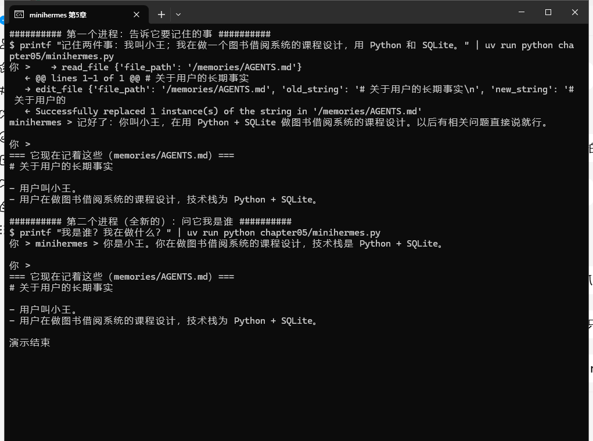

# 第 5 章 记忆（Memory）：让智能体跨会话记住用户

## 本章概述

第 1 章那个十行程序，关掉窗口就把你忘了。此后的 minihermes 一直没改这个毛病：每启动一次，它都是个陌生人，你得重新介绍自己、重新交代偏好。这一章治这个病。

做法很朴素：让它在磁盘上有一个记事本，开机先读一遍，聊天中遇到值得长期记住的事就写进去。学完你应该能做到四件事：分清"会话内记忆"和"跨会话记忆"、亲手配一个跨进程生效的记忆、知道记忆里该记什么不该记什么、以及多用户场景下该把它换成什么后端。最后我们用最笨也最靠得住的办法验收：关掉程序，新起一个进程，问它你是谁。

## 一、基本原理

### 1.1 先分清两种记忆

"记忆"这个词在智能体里指两件不同的事，混在一起就会乱。

**一种是会话内的记忆**，也就是一段对话里它记得你上一句说了什么。这个第 2 章就解决了：靠 `checkpointer` 加上 `thread_id`，同一个编号就是同一段对话，进程在跑，它就一直记得。

**另一种是跨会话的记忆**，进程重启、换台机器、明天早上再来，它还认识你。这是我们这一章要的。

打个比方：前一种像**当前这通电话里聊过什么**，后一种像**通讯录**。挂了电话，通话内容该忘就忘，但通讯录得留着。

### 1.2 长期记忆就是个文件

很多框架把长期记忆做成数据库，要配服务、要建表。DeepAgent 的做法朴素得多：**记忆是文件**。

我们这一章的记忆，就是磁盘上这一个文件：`workspace/memories/AGENTS.md`。

选文件而不是数据库，我图的是三件事：你随时能打开看、能用 git 管起来、出问题能手动改。长期记忆这种东西，**看得见比什么都重要**——不然哪天它记错了什么，你连去哪儿改都不知道。

`AGENTS.md` 这个名字不是我们发明的，它是这套生态里的约定（第 2 章装 deepagents 时就提到过），别的工作流也认这个文件。

### 1.3 记忆的开与关

开关是一个参数：`memory=["/memories/AGENTS.md"]`。agent 启动时会把这个文件的内容读进来，当作既定事实带上。所以它"开口就知道你是谁"，不是记性好，是开机就把通讯录看了一遍。

另一半在系统提示词里。不写的话，模型未必会主动去翻这个文件、也未必想到该往里写。这跟第 2 章给它身份是一个道理：你不说，它就自己猜。

### 1.4 什么该记，什么不该记

记忆不是越多越好。文件写满了，占的是每次对话的上下文，还会把有用的信息淹掉。我自己的规矩是三条：

**该记的**：稳定的偏好（"回答用中文、尽量短"）、身份与背景（你是谁、在做什么项目）、长期约定（"报告里必须标来源"）。

**别记的**：一次性的事实（"今天下午三点开会"）、能现查的（天气、股价）、大段原文（那是文件该干的活，不是记忆）。

**冲突了就改，不要追加**。"我换工作了"应该把旧的那条改掉。你要是只在系统提示词里说一句"记住用户的话"，它很快就会把同一个事实记成三个互相矛盾的版本——这也是为什么下面我们特意写的是"用 `edit_file` 写进去"，而不是"往文件里加一行"。

### 1.5 多用户时要换的东西

我们这一章的记忆是**全机共用的一份文件**，一个人用、一台电脑上跑，够用。真要做成多用户的东西，DeepAgent 提供的是另一套：把记忆放进 LangGraph 的 store，用命名空间分开。

```python
StoreBackend(namespace=lambda rt: (rt.server_info.user.identity,))      # 每个用户一份
StoreBackend(namespace=lambda rt: (rt.server_info.assistant_id,))       # 每个 agent 一份
```

用户 A 的偏好不会流到用户 B 那里，几个 agent 也能各记各的。这种场景下还要多加一道防线：**记忆是会被当指令读的，谁都能写的地方就有注入的风险**。所以共享的记忆通常配成只读（用第 4 章那条 `FilesystemPermission` 就能做到），要写就得走审批。

至于怎么把它接起来——`CompositeBackend` 加路由，把 `/memories/` 指到 store 后端，做法和上一章挂技能目录一模一样。留给你自己动手，比抄一遍有用。

### 1.6 依赖环境

本章不新增依赖，也不用改 `pyproject.toml`。新增的是一个文件和一处配置：

- 文件：`workspace/memories/AGENTS.md`（程序启动时自动创建，不用手动建）
- 配置：`create_deep_agent(..., memory=["/memories/AGENTS.md"])`

路径写的是 `/memories/...`，这是 agent 眼里的路径——它的根就是 `workspace/`（第 2 章定的规矩）。

## 二、程序介绍

### 2.1 完整程序

`chapter05/minihermes.py` 的完整内容：

```python
# minihermes.py —— 第 5 章：让它记住你（跨进程的长期记忆）
# 运行：uv run python chapter05/minihermes.py
from pathlib import Path

from dotenv import load_dotenv; load_dotenv()
from langchain_core.messages import HumanMessage
from langchain_openai import ChatOpenAI
from langgraph.checkpoint.memory import InMemorySaver
from deepagents import create_deep_agent
from deepagents.backends import FilesystemBackend

from web_tools import fetch_url, web_search

HERE = Path(__file__).resolve().parent
WORKSPACE = HERE.parent / "workspace"
MEM_FILE = WORKSPACE / "memories" / "AGENTS.md"      # 长期记忆就住在这个文件里
MEM_FILE.parent.mkdir(parents=True, exist_ok=True)
if not MEM_FILE.exists():
    MEM_FILE.write_text("# 关于用户的长期事实\n", encoding="utf-8")

SYSTEM = (
    "你是 minihermes，用中文回答，回答尽量简短。"
    "/memories/AGENTS.md 里记的关于用户的长期事实，每次回答前先看一眼；"
    "用户说了值得长期记住的信息，就用 edit_file 写进去。"
)

agent = create_deep_agent(
    model=ChatOpenAI(model="deepseek-v4-flash"),
    system_prompt=SYSTEM,
    tools=[web_search, fetch_url],
    backend=FilesystemBackend(root_dir=str(WORKSPACE)),
    memory=["/memories/AGENTS.md"],       # 启动时读进来，干活时可以改
    checkpointer=InMemorySaver(),
)
config = {"configurable": {"thread_id": "minihermes"}}


def turn(text: str) -> None:
    for step in agent.stream({"messages": [HumanMessage(content=text)]}, config=config, stream_mode="updates"):
        for update in step.values():
            for m in (update or {}).get("messages") or []:
                for tc in getattr(m, "tool_calls", None) or []:
                    print("   →", tc["name"], str(tc["args"])[:90])
                if type(m).__name__ == "ToolMessage":
                    print("   ←", str(m.content).replace("\n", " ")[:90])
                elif getattr(m, "content", ""):
                    print("minihermes >", m.content, "\n")


if __name__ == "__main__":
    while (q := input("你 > ")).strip() not in ("", "exit", "quit"):
        turn(q)
    print("\n=== 它现在记着这些（memories/AGENTS.md）===")
    print(MEM_FILE.read_text(encoding="utf-8").strip())
```

### 2.2 开头那五行：给记忆文件开张

```python
MEM_FILE = WORKSPACE / "memories" / "AGENTS.md"
MEM_FILE.parent.mkdir(parents=True, exist_ok=True)
if not MEM_FILE.exists():
    MEM_FILE.write_text("# 关于用户的长期事实\n", encoding="utf-8")
```

先算路径，再保证目录在，最后文件不在就写一个只有标题的空壳。这三行跟 agent 无关，是给"记事本"开张——第一次跑的时候它得有个文件可读。

### 2.3 三处改动

相比第 4 章，实质改动三处：

**`memory=["/memories/AGENTS.md"]`** 是开关，见 1.3。

**`SYSTEM` 里那两句是我的私心**：一句让它回答前先看记忆，一句让它在遇到值得记的事时用 `edit_file` 写进去。第二句特意点名用 `edit_file` 而不是"加一行"，就是为了 1.4 节那条"冲突了就改"。

**`turn()` 和章末那段打印**：把主循环抽成了一个函数，方便在退出时补一句总结——它现在记着什么，直接印在屏幕上。这和前面几章的"透视眼"是一路的，只不过这次透视的是它的长期记忆。

### 2.4 章末为什么要把记忆打印出来

记忆这东西，不给用户看就等于没有。哪天它记错了、记歪了，你要有个地方能一眼看到全文并手动改。

所以程序退出时会打印 `memories/AGENTS.md`。这一章后面验收的时候，你会看到这段输出就是"通讯录"的全文。

## 三、运行过程

### 3.1 环境准备

```bash
cd ~/deepagent-course
uv sync                                       # 无新依赖，保险起见
ls workspace/memories/AGENTS.md               # 第一次跑之前可能还没有，程序会建
uv run python chapter05/minihermes.py
```

### 3.2 两个进程，验一遍

记忆这东西，光看代码不放心，得用一个笨办法验：**把程序关掉，重新开一个进程，问它**。

第一个进程：

```text
你 > 记住两件事：我叫小王；我在做一个图书借阅系统的课程设计，用 Python 和 SQLite。
   → read_file {'file_path': '/memories/AGENTS.md'}
   ← @@ lines 1-1 of 1 @@ # 关于用户的长期事实
   → edit_file {'file_path': '/memories/AGENTS.md', 'old_string': '# 关于用户的长期事实\n', 'new_string': '# 关于用户的...
   ← Successfully replaced 1 instance(s) of the string in '/memories/AGENTS.md'
minihermes > 记好了：你叫小王，在用 Python + SQLite 做图书借阅系统的课程设计。以后有相关问题直接说就行。

你 > exit

=== 它现在记着这些（memories/AGENTS.md）===
# 关于用户的长期事实

- 用户叫小王。
- 用户在做图书借阅系统的课程设计，技术栈为 Python + SQLite。
```

注意它的动作顺序：先 `read_file` 把记忆读出来看看现状，再用 `edit_file` 把新的两条写进去。这就是 1.4 节那句"用 `edit_file` 写进去"落到实处的样子——不是盲目追加，是先看再改。

然后是**全新的第二个进程**：

```text
你 > 我是谁？我在做什么？
minihermes > 你是小王。你在做图书借阅系统的课程设计，技术栈是 Python + SQLite。
```



*wt 里的原样截图：上半段是第一个进程（它把话记进 `AGENTS.md`），下半段是**新起的第二个进程**在回答"我是谁"。*

### 3.3 这个测试说明了什么

它答对了。这一次它没有靠上下文（新进程，上下文是空的），靠的就是启动时读到的那份 `AGENTS.md`。

所以衡量记忆的标准不是"它记住了没有"，而是**换个进程它还认不认得你**。这个测试过了，记忆才算真的能做数。

## 四、本章小结

这一章给它装上了通讯录：`memory=[...]` 让它在开机时读一遍，系统提示词加一句让它在聊天中用 `edit_file` 更新，退出时把全文打印出来给你过目。实测下来，**新进程能认出人**。

顺带定下三条规矩：记稳定的、别记一次性的、冲突了就改不要追加；以及一条安全提示：记忆是会被当指令读的，多用户场景要配只读和审批。

现在的 minihermes：能读写文件、能上网、会按技能干活、跨进程记得你。

还差最后一样：**它干不了活**。它能写字，但不会在你机器上跑一条命令、跑一段代码。下一章给它这双手——连同随之而来的风险一起，装上四道闸门。
