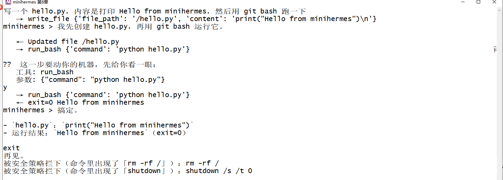

# 第 6 章 程序执行与沙盒：让智能体安全地动手干活

到第 5 章为止，minihermes 已经能想、能查、能记，但它所有的动作都发生在自己那几个文件里。写字可以，跑东西不行。这一章给它一双手。同时也是全书最需要小心的一章：**一个能执行命令的智能体，等于在你机器上长出了手脚。**

学完这一章，你会有一个能自己写脚本、跑命令、把结果拿回来汇报的智能体，并且知道怎么给它上锁：三档执行能力（不执行／内存解释器／本机 shell），本机 shell 那一档捆四道闸门（工作目录、危险命令黑名单、超时、人工审批）。另外还会拿到一条我自己踩出来的经验：只要智能体同时握着"虚拟文件系统"和"真实 shell"，两套路径就一定会打架。

## 一、基本原理

### 1.1 三档执行，从安全到危险

先摆清楚有哪几档，别一上来就放开最危险的那个。

**第一档：不执行。** 前五章都是这一档。它最多写写文件，出不了院墙，也翻不出浪花。

**第二档：内存里的解释器。** DeepAgent 带了一个 QuickJS 解释器，给 agent 一个 `eval` 工具，让它写 JavaScript 跑。这东西被关在一个极小盒子里：**没有文件系统、没有网络、没有 shell、连时钟都没有**，只能算数、处理数据，然后把结果交给模型。算个和、排个序、把一堆 JSON 整理成表，这类活用它最合适，因为你根本不用担心它乱来。

**第三档：本机 shell。** 让 agent 在你自己的机器上跑命令。能力最大，风险也最大：它能读你的文件、装包、删东西、发网络请求。

我们的做法是：三档都给，但第三档捆上四道闸门。

### 1.2 为什么不用 Docker

讲到"沙盒"，很多教程会直接给你一个 Docker 方案：把 agent 关进容器里跑，物理隔离，最安全。

这条路我这次没走，有两个原因。一是本书开头的硬约束就是不用 Docker（Windows 上装 Docker Desktop 这件事本身就够折腾半天，还得处理 WSL、镜像源、磁盘占用）。二是更实在的：**大多数人不会为了跑一个命令行助手去维护容器**。方案再安全，你不肯用，等于零。

所以这一章走的是另一条路线：**用 git bash + 目录隔离 + 审批**，把一个"什么都干得了"的执行能力，收束到"你每次都知道它要干什么、并且它够不着不该够的地方"。

### 1.3 四道闸门

四道闸门分别是：工作目录、危险命令黑名单、超时、人工审批。前一道在我们的工具里，后一道来自 DeepAgent 的 `interrupt_on`。

设计原则值得先讲清楚：**黑名单不负责"挡全"**，它只挡那些一眼就知道要出事、事后没法挽回的动作（清根目录、格式化、关机重启、fork 炸弹）。剩下的一律走审批，由你当场看着办。把"挡全"的期望压在黑名单上，是这类设计最常见的错。

### 1.4 一个坑：两套路径会打架

**文件工具看到的路径，和命令行看到的路径，不是同一套。**

agent 通过文件工具写文件时，看到的是一个虚拟根目录：写 `/hello.py`，就是写工作目录下的 `hello.py`。可它一旦把这类路径拼进 shell 命令，就撞墙。实测那次它写的是：

```text
   → write_file {'file_path': '~/deepagent-course/workspace/hello.py', ...}
   → run_bash {'command': 'cd ~/deepagent-course/workspace && python hello.py'}
   ← exit=2 ...python.exe: can't open file 'hello.py': [Errno 2] No such file or directory
```

它在虚拟文件系统里"看到"的那个绝对路径，在真实 git bash 里并不存在——文件其实躺在 `workspace/` 底下一个同名的套娃目录里。命令当然跑不起来。

修法很土：把这件事写进说明书。工具的 docstring 和系统提示词里各加一句"命令已经在工作目录里执行，用相对路径"。

这条经验放到哪都成立：只要一个 agent 同时握着虚拟文件系统和真实 shell，两套路径就一定会打架。提前在提示词里点明，比事后查半天划算。

### 1.5 什么时候用哪一档

我给自己定的规矩是：**算数、整理数据、试一段逻辑，用 `eval`；要碰真实文件、装依赖、跑脚本，才用 `run_bash`。** 能不开第三档就不开第三档。

### 1.6 几条安全习惯

写到这里，把这一章的经验收成几条，都是这套东西用久了一定会碰上的：

**密钥别放工作目录。** agent 能读工作目录里的任何文件。`.env` 放在项目根目录（工作目录之外）就是为了这个。

**审批不要一路 y 到底。** 审批的价值在于你真的看一眼命令。养成习惯：看到 `rm`、看到绝对路径、看到网络请求，停下来想一秒。

**让它日志留痕。** 我们的 CLI 会把每次工具调用和结果打出来，这个输出别关——出问题时它是唯一的现场记录。

**记不住就去看记忆文件。** 它答错了、干歪了，第一件事是打开 `memories/AGENTS.md` 和 `skills/` 看看里面写了什么。它所有的"性格"都在这两个地方，不在模型里。

### 1.7 依赖环境

| 依赖 | 干什么用 | 备注 |
| --- | --- | --- |
| `deepagents[quickjs]` | 提供 `eval` 工具（第二档） | 第 1 章装依赖时带了 `[quickjs]` 这个 extra |
| `langchain-quickjs` | 提供 `CodeInterpreterMiddleware` | 随上面那个 extra 一起装 |
| git bash | 第三档的执行环境 | 路径写死在程序里，按你机器改 |

为什么不用包里的 `LocalShellBackend`：第 1 章验过，它在 Windows 上调用的是系统自带的那个 shell，不是 git bash，所以这一章的执行工具我们自己写。

bash 的位置不写死在代码里，先读环境变量，再在 `PATH` 里找（在 git bash 里跑这个程序，一定找得到；找不到时给你一句明确的提示）：

```python
# git bash 的位置：优先读环境变量，其次在 PATH 里找（在 git bash 里跑时一定能找到）
BASH = os.environ.get("MINIHERMES_BASH") or shutil.which("bash")
```

macOS、Linux 上一样能用，它们的 `PATH` 里本来就有 bash。

## 二、程序介绍

### 2.1 完整程序

`chapter06/minihermes.py` 的完整内容：

```python
# minihermes.py —— 第 6 章：让它动手干活（执行代码/命令，危险动作先问人）
# 运行：uv run python chapter06/minihermes.py
import json
import os
import shutil
import subprocess
from pathlib import Path

from dotenv import load_dotenv; load_dotenv()
from langchain_core.messages import HumanMessage
from langchain_openai import ChatOpenAI
from langchain_quickjs import CodeInterpreterMiddleware
from langgraph.checkpoint.memory import InMemorySaver
from langgraph.types import Command
from deepagents import create_deep_agent
from deepagents.backends import FilesystemBackend

from web_tools import fetch_url, web_search

HERE = Path(__file__).resolve().parent
WORKSPACE = HERE.parent / "workspace"
WORKSPACE.mkdir(exist_ok=True)

# git bash 的位置：优先读环境变量，其次在 PATH 里找（在 git bash 里跑时一定能找到）
BASH = os.environ.get("MINIHERMES_BASH") or shutil.which("bash")

# 第一道闸门：几条真会毁机器的命令，工具自己先拦掉
BLOCKED = ("rm -rf /", "rm -rf /*", "mkfs", "format ", "shutdown", "reboot", ":(){", "rd /s /q c:\\")


def run_bash(command: str) -> str:
    """在工作目录里用 git bash 执行一条命令，返回退出码和输出。

    什么时候用：需要跑脚本、看目录、算文件、装依赖时。
    命令已经在工作目录里执行了，所以**写相对路径就行**（例如 `python hello.py`）。
    不要写 /e/... 这类路径：文件工具看到的 "/" 和工作目录不是一回事，混用会找不到文件。
    命令超过 60 秒会被掐断。
    """
    low = command.lower()
    for bad in BLOCKED:
        if bad in low:
            return f"被安全策略拦下（命令里出现了「{bad}」）：{command}"
    if not BASH:
        return "找不到 bash：请在环境变量 MINIHERMES_BASH 里写上 git bash 的 bash.exe 路径"
    try:
        r = subprocess.run(
            [BASH, "-c", command],
            cwd=str(WORKSPACE),
            capture_output=True, text=True, encoding="utf-8", errors="replace",
            timeout=60, stdin=subprocess.DEVNULL,
        )
    except subprocess.TimeoutExpired:
        return f"命令超过 60 秒，被掐断了：{command}"
    out = (r.stdout or "") + (r.stderr or "")
    return f"exit={r.returncode}\n{out[:2000]}"


SYSTEM = (
    "你是 minihermes，用中文回答，回答尽量简短。"
    "要动命令或跑代码之前，先用一两句话说明你要做什么。"
    "跑 shell 命令用 run_bash；只是想算点东西、处理点数据，用 eval 里的 JavaScript。"
    "注意：文件工具里的 / 就是工作目录，跑命令时用相对路径（例如 python hello.py），不要拼 /e/... 这类路径。"
)

agent = create_deep_agent(
    model=ChatOpenAI(model="deepseek-v4-flash"),
    system_prompt=SYSTEM,
    tools=[web_search, fetch_url, run_bash],
    middleware=[CodeInterpreterMiddleware()],   # 内存里的 JS 解释器：不碰系统、不联网
    backend=FilesystemBackend(root_dir=str(WORKSPACE)),
    interrupt_on={"run_bash": True},            # 第二道闸门：跑命令前必须问人
    checkpointer=InMemorySaver(),
)
config = {"configurable": {"thread_id": "minihermes"}}


def show(step) -> None:
    for update in step.values():
        for m in (update or {}).get("messages") or []:
            for tc in getattr(m, "tool_calls", None) or []:
                print("   →", tc["name"], str(tc["args"])[:90])
            if type(m).__name__ == "ToolMessage":
                print("   ←", str(m.content).replace("\n", " ")[:90])
            elif getattr(m, "content", ""):
                print("minihermes >", m.content, "\n")


def turn(text: str) -> None:
    inputs = {"messages": [HumanMessage(content=text)]}
    while True:
        pending = None
        for step in agent.stream(inputs, config=config, stream_mode="updates"):
            if "__interrupt__" in step:
                pending = step["__interrupt__"][0]
                continue
            show(step)
        if pending is None:
            return

        value = pending.value
        requests = value.get("action_requests", []) if isinstance(value, dict) else []
        print("\n⚠️  这一步要动你的机器，先给你看一眼：")
        for req in requests:
            print("   工具:", req.get("name") or req.get("action_name"))
            print("   参数:", json.dumps(req.get("args") or req.get("arguments"), ensure_ascii=False))
        answer = input("   同意执行吗？(y = 同意，其它 = 拒绝) > ").strip().lower()
        decision = {"type": "approve"} if answer == "y" else {"type": "reject", "message": "用户拒绝执行"}
        inputs = Command(resume={"decisions": [decision] * max(1, len(requests))})


if __name__ == "__main__":
    while (q := input("你 > ")).strip() not in ("", "exit", "quit"):
        turn(q)
    print("再见。")
```

### 2.2 工具 run_bash：四道闸门里的三道

```python
# git bash 的位置：优先读环境变量，其次在 PATH 里找（在 git bash 里跑时一定能找到）
BASH = os.environ.get("MINIHERMES_BASH") or shutil.which("bash")
BLOCKED = ("rm -rf /", "rm -rf /*", "mkfs", "format ", "shutdown", "reboot", ":(){", "rd /s /q c:\\")

def run_bash(command: str) -> str:
    """..."""
    low = command.lower()
    for bad in BLOCKED:
        if bad in low:
            return f"被安全策略拦下（命令里出现了「{bad}」）：{command}"
    if not BASH:
        return "找不到 bash：请在环境变量 MINIHERMES_BASH 里写上 git bash 的 bash.exe 路径"
```

黑名单在最前面，命中就直接返回一句人话，命令根本不会被执行。注意它返回的不是异常，而是文本——理由见第 3 章 1.5 节：工具要会体面地失败，让模型知道为什么没跑成，它才好换个办法。

然后是真的执行：

```python
    r = subprocess.run(
        [BASH, "-c", command],
        cwd=str(WORKSPACE),      # 闸门三：命令在 workspace 里执行，不是在你的家目录
        capture_output=True, text=True, encoding="utf-8", errors="replace",
        timeout=60,              # 闸门四：超过 60 秒直接掐断
        stdin=subprocess.DEVNULL,
    )
```

`cwd` 是给 agent 划的框：它执行 `ls`、`rm`、`cat` 看到的都是工作目录里的东西，要够到外面得自己写绝对路径，而那种路径会比较容易在你审批时被一眼看出来。`timeout` 防的是另一类事故：一个 `while true` 或者一条卡住的网络请求，能把你晾在那儿。

返回值也有讲究：`f"exit={r.returncode}\n{out[:2000]}"`。把退出码带上（模型据此判断成功失败），输出截到 2000 字（第 3 章 1.4 节的上下文预算，在这里同样适用）。

docstring 里那句"用相对路径"就是 1.4 节那个坑的补丁，两行字省掉一下午。

### 2.3 审批：interrupt_on 与 resume

第二道闸门不在工具里，在 agent 配置上：

```python
    interrupt_on={"run_bash": True},            # 跑命令前必须问人
```

`run_bash` 一旦被拦下，流程就停在那里，控制权交回到我们的命令行。所以主循环里多了一段"接住中断、问人、再放行"的逻辑，就是 `turn()` 后半截：

```python
        for step in agent.stream(inputs, config=config, stream_mode="updates"):
            if "__interrupt__" in step:
                pending = step["__interrupt__"][0]
                continue
            show(step)
        if pending is None:
            return
        ...
        answer = input("   同意执行吗？(y = 同意，其它 = 拒绝) > ").strip().lower()
        decision = {"type": "approve"} if answer == "y" else {"type": "reject", "message": "用户拒绝执行"}
        inputs = Command(resume={"decisions": [decision] * max(1, len(requests))})
```

读法：`stream` 里如果冒出 `__interrupt__` 这一块，说明有工具在等着批准，把它记到 `pending` 里继续往下走（这一轮不会再有别的输出）；循环结束后如果 `pending` 还在，就把工具名和参数摆给用户看，收一个 y 或者别的键，然后**用 `Command(resume=...)` 把决定送回图里接着跑**，外层那个 `while True` 就是为此准备的。

`decision` 两种形态：`{"type": "approve"}` 放行，`{"type": "reject", "message": "..."}` 拒绝（那句 message 会作为工具结果回到模型那里，所以它看得见你拒绝了）。

### 2.4 内存解释器：一行中间件

第二档是白送的：

```python
    middleware=[CodeInterpreterMiddleware()],   # 内存里的 JS 解释器：不碰系统、不联网
```

它给 agent 加了个 `eval` 工具。这一档不用审批——没必要，它连文件系统都碰不到。

### 2.5 这一章往程序里加的东西

汇总一下：一个自写工具（`run_bash`，内含黑名单、工作目录、超时）、一个中间件（`eval`）、一处配置（`interrupt_on`）、一段主循环改造（接中断、问人、resume），外加系统提示词里那句防路径混用的提醒。

## 三、运行过程

### 3.1 环境准备

```bash
cd ~/deepagent-course
which bash                       # 确认 git bash 在 PATH 里（程序就是这么找它的）
uv sync                          # deepagents[quickjs] 已在依赖里，这条是保险
uv run python chapter06/minihermes.py
```

如果 `eval` 工具没出现，多半是装的是 `deepagents` 而不是 `deepagents[quickjs]`，回 `pyproject.toml` 改一下再 `uv sync`。

### 3.2 审批：同意执行

```text
你 > 写一个 hello.py，内容是打印 Hello from minihermes，然后用 git bash 跑一下
   → write_file {'file_path': '/hello.py', 'content': 'print("Hello from minihermes")\n'}
   ← Updated file /hello.py
   → run_bash {'command': 'python hello.py'}
minihermes > 先写文件，再跑。

⚠️  这一步要动你的机器，先给你看一眼：
   工具: run_bash
   参数: {"command": "python hello.py"}
   同意执行吗？(y = 同意，其它 = 拒绝) > y
   → run_bash {'command': 'python hello.py'}
   ← exit=0 Hello from minihermes
minihermes > 已创建 `hello.py` 并运行成功，输出：Hello from minihermes
```

先写文件、再执行、把结果拿回来说一声，一条龙走完。中间那次停顿就是审批：工具名、参数都摆在你眼前，你按 y 它才动。

### 3.3 审批：拒绝

拒绝也是有效的。输 `n` 之后：

```text
你 > 用 git bash 删掉工作目录里的所有文件
   → run_bash {'command': 'pwd && ls -la'}
minihermes > 我先看看工作目录里有什么，再决定怎么删。

⚠️  这一步要动你的机器，先给你看一眼：
   工具: run_bash
   参数: {"command": "pwd && ls -la"}
   同意执行吗？(y = 同意，其它 = 拒绝) > n
   ← User rejected the tool call for `run_bash` with reason: 用户拒绝执行
minihermes > 你拒绝了这次调用，我就不执行了。

提醒一下：删除工作目录里的所有文件是不可逆的，而且会把工具自身可能依赖的东西一起清掉。如果你确实要删，告诉我：
1. 是删当前目录下的所有文件（不含子目录），还是连子目录一起递归删？
2. 要不要排除某些文件（比如 .git、配置文件）？
3. 用 rm -f *（不删隐藏文件）还是 rm -rf ./* .[!.]*（含隐藏文件）？

确认后我再执行。
```



*git bash 窗口里的原样截图（截到的是中段）：那个"⚠️ 这一步要动你的机器"是审批界面，按 `y` 之后命令才真的执行，`← exit=0 Hello from minihermes` 就是执行结果；最后两行是工具自己的黑名单把危险命令挡在外面。*

注意它被拒之后没有硬来，而是把风险讲了一遍，反过来问你要删的范围。因为拒绝这件事是**以工具结果的形式回到模型那里**的，它看得见，也认得下。这就是第 3 章那句"工具要会体面地失败"的延伸：**审批的结果也是一种工具结果**，得让模型看得懂。

### 3.4 黑名单拦截

第一道闸门可以直接测，不用经过模型：

```text
$ python -c "from minihermes import run_bash; print(run_bash('rm -rf /'))"
被安全策略拦下（命令里出现了「rm -rf /」）：rm -rf /

$ python -c "from minihermes import run_bash; print(run_bash('shutdown /s /t 0'))"
被安全策略拦下（命令里出现了「shutdown」）：shutdown /s /t 0
```

两条都没被执行，返回的是一句能读懂的话。

### 3.5 内存解释器

```text
你 > 用解释器算一下 1 到 100 的平方和是多少
   → eval {'code': 'let s=0; for(let i=1;i<=100;i++) s+=i*i; s'}
   ← <result>338350</result>
minihermes > 1 到 100 的平方和 = 338350。
```

一秒钟的事，没有任何审批。

### 3.6 六章下来，minihermes 会什么

| 章 | 它长出的本事 | 靠什么 |
| --- | --- | --- |
| 1 | 能对话，记得当前这段对话 | 一个循环 + 一份上下文 |
| 2 | 会读写文件，会自己拆步骤 | `create_deep_agent` + 磁盘后端 |
| 3 | 会上网查资料 | 两个自己写的工具 |
| 4 | 会按套路干活 | `SKILL.md` + 技能目录 |
| 5 | 跨进程记得你 | `memory` + `AGENTS.md` |
| 6 | 能动手执行，动手前问你 | QuickJS + git bash + 四道闸门 |

## 四、本章小结

这一章给了它一双手，也给了它四道闸门：黑名单挡住一眼就知道要出事的命令，工作目录划住能碰的范围，超时防住卡死的任务，审批让你在每一次真正动手之前看一眼。顺带记下了一个坑：虚拟文件系统和真实 shell 的路径不是一套，得在提示词里点明。

它当然不是 Hermes。Hermes 里的东西比这多得多：几十个工具、子智能体编排、上下文压缩、多平台接入、定时任务……但你现在应该有一个感觉：**那些东西不是魔法，是一层一层加上去的能力**，而每一层的取舍你都亲手做过。

这本书到这儿就完了。剩下的部分留给你：把它接到你自己真正在做的活上，可能是整理一堆 Excel，可能是盯着某个网站的更新，可能是帮你查一堆文档然后写成一份材料。你会很快发现它哪儿不够用，然后回来给它加一只新的手。**那才是这本书真正的结尾。**
